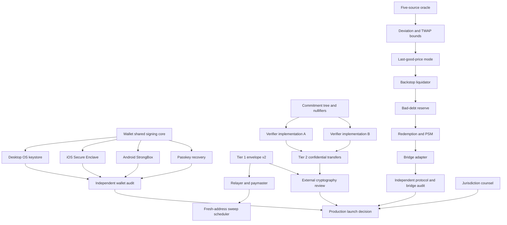

# MindChain production-hardening implementation plan

## Objective

Move the current valueless engineering network toward a staged production candidate without treating unreviewed cryptography, bridge code, legal conclusions, or browser key storage as production-ready. Every mechanism below has an explicit dependency, implementation contract, falsifier, and release gate.

## Non-negotiable release rules

1. A feature is not called production-ready merely because it compiles or passes internal tests.
2. Private-payment claims distinguish address/memo privacy from amount confidentiality.
3. Stable minting, borrowing, and bridge ingress fail closed when required external truth is unavailable.
4. Redemption remains available when minting is paused unless collateral itself is unsafe or legally frozen by its issuer.
5. Agent loss is bounded by consensus-enforced capabilities, not frontend policy.
6. Production keys are hardware-backed, purpose-separated, rotatable, and recoverable.
7. Bridge exposure, collateral debt ceilings, PSM inventory, and protocol reserves are independently capped.
8. External legal opinions and independent audit reports must be delivered by named qualified firms; internal code cannot manufacture those conclusions.

## Dependency graph

## Wallet platforms

### Shared core

The Rust wallet remains the single source of truth for:

- Chain and genesis identity gating.
- Purpose-separated derivation.
- Canonical transaction review.
- Ed25519 signing domains.
- Agent capability interpretation.
- Private-payment envelope encoding and scanning.
- Backup metadata and recovery policy.

Platform shells may hold key handles but may not reimplement transaction semantics.

### Desktop

Target: Tauri shell with a Rust command boundary and OS-keystore adapters.

- Windows: CNG/NCrypt persisted key or DPAPI-protected wrapping key, preferring TPM-backed non-exportable material when available.
- macOS: Keychain key item with Secure Enclave-backed signing where supported.
- Linux: Secret Service/libsecret wrapping key; hardware token through PKCS#11 as the higher-trust option.
- The UI receives public keys, signatures, and typed errors only.
- Export requires an explicit encrypted recovery package; raw private-key export is unavailable in normal operation.

Gate: signing, lock, recovery, key deletion, and wrong-origin tests on each OS; code-signing and reproducible release artifacts.

### iOS

- Secure Enclave P-256 cannot directly replace MindChain Ed25519 consensus signatures.
- Use Secure Enclave P-256 to unwrap an encrypted Ed25519 seed held in Keychain with `kSecAttrAccessibleWhenUnlockedThisDeviceOnly`, or adopt a protocol-level P-256 signature suite only through a versioned hard fork.
- Require LocalAuthentication for unwrap/sign policy according to user risk settings.
- Separate spend, scan, agent, and recovery keys.
- Background scan uses the scan key and cannot spend.

Gate: on-device tests on supported hardware, backup/recovery ceremony, jailbreak-risk disclosure, biometric fallback behavior, and App Store review.

### Android

- Prefer StrongBox-backed AES or EC wrapping key with user authentication requirements.
- Fall back to hardware-backed Android Keystore only with an explicit trust-tier warning.
- Encrypt the Ed25519 seed under the hardware key; plaintext seed exists only inside the short signing operation and is zeroized afterward.
- Separate scan-only background work from spending authorization.

Gate: StrongBox and non-StrongBox devices, biometric enrollment changes, lock-screen removal, backup exclusion, rooted-device disclosure, and Play integrity policy review.

### Browser passkey recovery

- WebAuthn passkeys authenticate recovery; they do not expose a general encryption secret consistently across providers.
- Use the WebAuthn PRF extension when supported to derive a vault-wrapping key.
- When PRF is unavailable, use a server-assisted threshold recovery share only with explicit user consent and a second independent recovery factor.
- Bind recovery credentials to chain ID, wallet public ID, RP ID, credential ID, and vault version.
- Never treat a successful WebAuthn assertion alone as sufficient to decrypt a wallet unless the PRF-derived secret or threshold shares reconstruct the wrapping key.

Gate: PRF-supported and unsupported browsers, credential loss, synced-passkey provider compromise, origin mismatch, replay, and downgrade tests.

## Tier 1 relayer and sweep automation

### Relayer

- Accept only signed, bounded relay intents.
- Bind chain ID, genesis hash, payment ID, destination, maximum relay fee, nonce, and expiry.
- Relayer never receives a spending key or claim secret before the signed intent authorizes the exact claim.
- Rate-limit by source, payment, and destination commitment.
- Simulate before submission and return a canonical receipt.
- Maintain no discretionary custody balance beyond capped operational gas inventory.

### Fresh-address sweeps

- Default destination is a newly derived account, never the user’s main displayed account.
- Sweep plans bind payment ID, fresh destination, amount, maximum fee, earliest height, latest height, and relayer.
- A sweep may not merge multiple private receipts unless the user explicitly accepts the linkage.
- Gas sponsorship must not fund the fresh address from the user’s known main account.

### Randomized delay

- Delay is sampled locally from a bounded policy distribution using cryptographic randomness.
- The chosen earliest/latest window is committed before relay submission so the relayer cannot selectively accelerate targeted users.
- The wallet displays that timing randomization reduces simple linkage but does not defeat a global statistical adversary.
- Urgent mode is explicit and warns that immediate sweeping weakens Tier 1 privacy.

Gate: replay, fee substitution, destination substitution, timing manipulation, relayer withholding, and duplicate-claim tests.

## Tier 2 confidential amounts and balances

### State model

- Public append-only commitment tree for shielded notes.
- Public nullifier set preventing double spend.
- Public shielded-pool total commitment and auditable stable supply bridge.
- Stable mint into the shielded pool increases the public pool total by the same amount.
- Stable burn/redemption from the shielded pool proves a matching decrease.
- No hidden mint authority or unbound value commitment.

### Circuit relations

The transfer circuit proves:

1. Input commitments exist at an accepted tree root.
2. The spender knows each input opening and authorization key.
3. Nullifiers derive correctly and are unique.
4. Input value equals output value plus public fee.
5. Every value is in range.
6. Asset IDs match or follow an explicitly supported conversion relation.
7. Output commitments and encrypted note payloads bind the same values and recipients.
8. Chain ID, circuit version, tree root, public pool-total transition, and transaction expiry are public inputs.

### Verifier diversity

Verifier A and verifier B must:

- Be independently implemented, not wrappers around the same library.
- Parse canonical public inputs independently.
- Agree on verification-key identity and circuit version.
- Reject malformed encodings, noncanonical fields, subgroup failures, oversized proofs, and trailing bytes.
- Run against shared valid/invalid vector corpora and differential fuzzing.

No Tier 2 state transition activates unless both verifiers accept.

Gate: external circuit review, trusted-setup or transparent-parameter review, independent verifier audit, proving benchmarks, mobile scanning benchmarks, emergency exit proof, and supply-conservation simulation.

## Production oracle

### Five-source quorum

- Minimum five configured reporters.
- Minimum three fresh reports for a price.
- Reporter infrastructure and signing custody must be independently operated.
- Report metadata includes source timestamp, observation height, sequence, price, and confidence.
- Governance can rotate one reporter at a time under delay; emergency removal cannot install a replacement or loosen thresholds.

### Deviation and TWAP bounds

- Maintain a bounded observation ring per feed.
- Compute deterministic integer TWAP over a configured block window.
- Reject or quarantine reports outside configured deviation from last-good price and TWAP.
- Bounds are operation-specific: borrow valuation, collateral withdrawal, liquidation, and redemption may use different conservative sides.
- Thin native AMM prices are not launch oracle inputs.

### Last-good-price mode

- Fresh quorum updates last-good price.
- Missing quorum or excessive divergence pauses new borrowing, minting, and collateral withdrawal.
- Repayment remains enabled.
- Liquidation may use last-good price with a configured conservative haircut and maximum age.
- Once maximum last-good age expires, liquidation also pauses rather than using indefinitely stale data.
- Every rejected report and mode transition is indexed and alertable.

Gate: compromised reporters, clock skew, stale feeds, 50% source outage, large legitimate jump, gradual manipulation, and recovery tests.

## Backstop, bad debt, redemption, and PSM

### Backstop liquidator

- Separate service key with no governance or mint authority.
- Watches health factors through authenticated RPC.
- Simulates profitability using oracle price, pool depth, fees, bonus, and congestion reserve.
- Submits bounded liquidations with minimum collateral output.
- Inventory and daily loss caps are enforced on-chain or by a dedicated capability.
- Multiple operators can run the same deterministic strategy.

### Stability reserve

- Explicit reserve object funded by protocol revenue or governance-approved deposits.
- Reserve assets, liabilities, and draw history are public.
- Draw occurs only against finalized bad-debt records.
- Per-event and epoch draw caps apply.
- Socialization order is fixed: seized collateral, market reserve, protocol stability reserve, then governance-approved recapitalization. No silent stable-holder haircut.

### Redemption and PSM

- Direct redemption burns stable supply and releases backing or PSM inventory under deterministic fees and caps.
- Mint and redeem limits are independent.
- Mint can pause while redemption remains active.
- PSM accepts only explicitly configured external stable assets with separate issuer, bridge, and depeg limits.
- Per-block, per-hour, inventory, and price-deviation caps constrain PSM flow.
- Stable supply/debt/reserve accounting remains conserved after every operation.

Gate: bank-run, reserve depletion, collateral depeg, PSM asset freeze, asymmetric pause, and rounding-drain tests.

## Bridge

A production bridge cannot be implemented generically without choosing the external chain, finality model, canonical asset issuer, validator/security model, and operational owner. The bridge contract is therefore an adapter interface plus a launch gate, not an invented universal bridge.

Required properties:

- Finality proof or explicitly documented validator quorum.
- Replay-protected message IDs bound to source and destination chain IDs.
- Ordered or idempotent mint/burn accounting.
- Per-asset hourly and total exposure caps.
- Separate bridged-asset debt ceilings and lower collateral factors.
- Delayed upgrades and independent emergency rate reduction.
- Withdrawal remains possible during ingress pause where safely verifiable.
- Reconciliation proves source escrow equals destination wrapped supply.

Chain selection and security assumptions require an owner decision before implementation can safely proceed.

## External assurance work packages

### Jurisdiction counsel

Counsel deliverables per jurisdiction:

- Stable-asset legal characterization.
- Mint, redemption, custody, money-transmission, e-money, securities, commodities, sanctions, privacy, consumer protection, tax, and reporting analysis.
- Agent-payment agency and liability analysis.
- Relayer/paymaster licensing analysis.
- Wallet distribution and app-store restrictions.
- Approved and prohibited product language.

Internal engineering records questions and implements controls; it does not issue legal conclusions.

### Cryptography review

External reviewer receives:

- Tier 1 envelope specification and vectors.
- Domain separation and AAD table.
- Nonce and ephemeral-key lifecycle.
- View-tag leakage model.
- Scan/spend key separation.
- Relayer and sweep protocol.
- Tier 2 circuits, setup/parameters, verifier implementations, and emergency exit.

### Protocol and wallet audits

At least two independent firms should split scope:

- Consensus, oracle, lending, PSM, reserve, liquidation, and bridge.
- Wallet key custody, native platform bindings, WebAuthn recovery, relayer, private-payment scanning, agent capabilities, and UI transaction review.

All critical/high findings must be closed and retested. Published reports must identify commit hashes and excluded scope.

## Execution order

1. Upgrade oracle and stable-asset safety controls because they protect all later value.
2. Build the shared native wallet key-handle interface and platform adapters.
3. Build passkey recovery and Tier 1 relayer/sweep flows.
4. Build backstop, reserve, and redemption/PSM.
5. Freeze Tier 2 relations, circuits, and dual-verifier interface before implementation.
6. Choose a bridge target and security model; implement only after that decision.
7. Commission counsel and external reviews against frozen commits.
8. Run end-to-end adversarial networks with capped value before any production launch.

## Definition of done

A listed mechanism is complete only when implementation, deterministic tests, adversarial tests, live isolated-network proof, operator runbook, monitoring, recovery path, and applicable external review are all present. Items requiring outside counsel, independent auditors, hardware, app stores, or an external chain remain explicitly blocked until those parties and targets are supplied.
