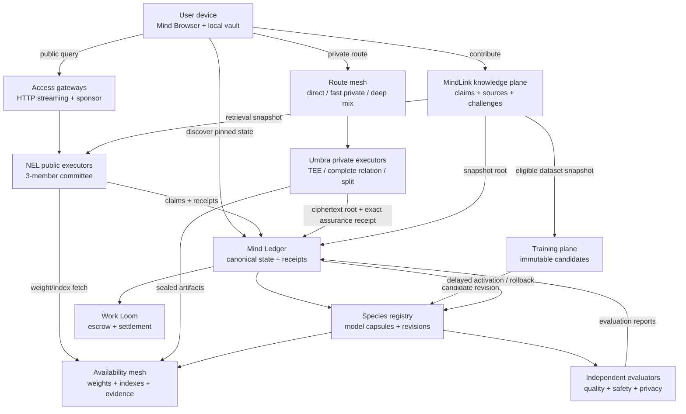
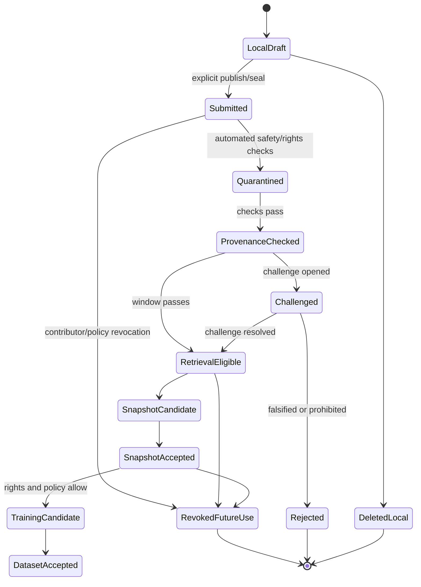

# World Wide Mind: Chain-Coordinated AI, Private Inference, and Decentralized Browser

**Architecture and R&D plan — protocol core and loopback pilot implemented; production rollout remains proposed**

**Repository:** NOOSPHERE protocol / MindChain product  
**Date:** 2026-07-14  
**Decision owner:** protocol and product owners  
**Scope:** public inference, private inference, model availability, knowledge contribution, governed model improvement, access browser, economics, verification, fault recovery, experiments, and implementation work packages

## 1. Executive decision

Build the World Wide Mind as a **chain-coordinated model fabric**, not as a neural network whose raw weights and token-by-token arithmetic execute inside base consensus.

The phrase “the model lives on the blockchain” has one technically defensible meaning:

- MindChain canonically identifies every model, tokenizer, numeric profile, decoding profile, policy, evaluator, dataset snapshot, adapter, and revision.
- MindChain orders immutable model revisions and their activation, challenge, rollback, and retirement records.
- MindChain selects and pays bonded executors, custodians, challengers, evaluators, relays, and trainers.
- MindChain anchors commitments, availability certificates, execution receipts, disputes, evaluation reports, and provenance roots.
- Content-addressed weights, indexes, private ciphertexts, traces, and training artifacts remain off-chain in bounded availability networks.
- Optional AI workers perform inference and training. Ordinary base validators do **not** need a GPU and do not replay a large model.

This division is load-bearing. Putting multi-gigabyte weights or transformer execution in every validator would reduce validator diversity, make block validity depend on GPU vendors and drivers, multiply network traffic, expose private prompts, and make consensus liveness inherit AI workload failures. The existing repository already encodes the safer rule: AI is application settlement, `NEURAL_LANE_ENABLED` is false, `PROOFPOWER` is zero, Work Loom cannot affect issuance or finality, and Chorus has zero proposal/finality weight.

The target product has five separable systems:

1. **Public Mind Query:** globally accessible, no-wallet-first inference against an immutable model revision, with streamed provisional tokens and later execution assurance.
2. **Umbra Private Query:** explicit, fail-closed confidentiality profiles whose labels state exactly who can see plaintext and what trust remains.
3. **Mind Browser:** a signed local client that resolves chain-anchored content and services, isolates origins and local data, and offers distinct direct, fast-private, and deep-private routes.
4. **MindLink Knowledge Plane:** a typed, rights-aware, challengeable graph in which people contribute exact words, sources, corrections, experiences, and domain knowledge before any content is eligible for model training.
5. **Species Improvement Plane:** immutable candidate adapters and revisions, independent training and evaluation, delayed activation, canary deployment, and deterministic rollback. The serving model never mutates itself in place and never activates its own update.

The first production-capable sequence is deliberately asymmetric:

1. public deterministic inference;
2. MindLink contribution and retrieval;
3. attested private inference;
4. shadow-only adapter training and governed promotion;
5. broader private browsing and stronger split/MPC/FHE/ZK inference only after their own evidence gates.

The architecture does **not** promise a magical combination of low latency, low bandwidth, no hardware trust, no non-collusion assumption, arbitrary model size, public verifiability, and zero metadata leakage. No demonstrated system currently provides all of those properties together. Each privacy profile is therefore an exact, non-orderable contract rather than a marketing tier.

## 2. Concrete product goals

### 2.1 User goals

A person must be able to:

- ask a public question without installing a node, buying hardware, or first creating a wallet;
- pin or inspect the exact model revision, knowledge snapshot, decoding policy, privacy profile, price ceiling, and result status;
- see sources and provenance separately from execution verification;
- choose a private mode **before** entering a prompt;
- learn, in one sentence, which parties or trusted hardware can see plaintext;
- prevent prompt, output, browsing history, telemetry, and contribution reuse by default in private mode;
- contribute knowledge using their exact words, explicit visibility, attribution, rights, and training permissions;
- correct, challenge, supersede, or revoke future use of a contribution without pretending an already-public commitment can be erased;
- pin an older model revision when governance activates a newer one;
- export their local vault, contributions, receipts, and model/version history;
- self-host an access gateway, executor, custodian, challenger, relay, evaluator, or trainer without becoming a base validator.

### 2.2 Network goals

The network must:

- remain live and safe when every AI process is offline;
- preserve consensus priority over AI, storage, browser, and training traffic;
- keep validator verification bounded and independent of model size;
- tolerate executor disagreement, worker loss, shard loss, route loss, bad updates, and index rebuilds without corrupting base consensus;
- make model substitution, policy substitution, quote replay, receipt replay, route downgrade, and browser-update substitution detectable and rejectable;
- pay useful application work from escrow without granting consensus weight or new issuance;
- keep model identity, execution fidelity, quality, provenance, privacy, availability, and truth as separate claims;
- support model forks rather than force one governance body to define a single universal mind.

### 2.3 Non-goals

This plan does not make the following claims:

- every model parameter is stored in consensus state;
- every validator performs inference or training;
- a valid execution receipt proves an answer is true, safe, unbiased, current, or useful;
- TLS, QUIC, onion routing, OHTTP, a VPN, or an encrypted prompt blob makes remote inference end-to-end private from the executor;
- TEE attestation is equivalent to a complete cryptographic proof;
- split inference remains private when all split parties collude;
- secure aggregation prevents poisoning;
- token voting establishes factual truth;
- a decentralized browser makes arbitrary web destinations unable to identify a logged-in user;
- low-latency routing defeats a global passive observer;
- an immutable public contribution can later be physically deleted from every copy;
- the model may rewrite its evaluation policy, spending authority, permissions, or serving alias;
- AI work ever gains proposal weight, finality weight, or issuance authority.

## 3. Repository baseline and constraints

This plan extends existing primitives instead of creating a second architecture beside them.

### 3.1 Current evidence state

As of this document’s date:

- `protocol/claims/registry.json` contains 136 claims.
- Canonical implementation status is 65 `IMPLEMENTED` and 71 `PARTIAL`.
- Local implementation state is 71 `IMPLEMENTED` and 65 `PARTIAL`.
- Canonical evidence is 25 `MEASURED_LAB` and 111 `UNMEASURED`.
- Local evidence is 67 `VERIFIED`, 10 `PARTIAL`, and 59 `MISSING`.
- Every claim has owner blockers; 40 claims also have external blockers.
- 20 claims are enabled and 116 are disabled.
- `G0`, `G1`, `G2`, `G3`, `GENESIS`, `G4`, and `G5` are all `BLOCKED` in `protocol/release/promotion-blockers.json`.

A World Wide Mind pilot may run on a local devnet or explicitly valueless public testnet, but it cannot be described as production, mainnet, or generally available while those base release gates remain blocked.

#### Implemented loopback pilot boundary

`crates/noos-mind-gateway` now contains the replaceable public-query protocol
core and a runnable HTTP service. The service pins declared model and policy
identities to a live finalized test-network checkpoint, issues bounded signed
quotes, streams a local model response, settles the test sponsor accounting,
and persists a signed gateway receipt. `site/query.html` consumes that contract.

This implementation is deliberately narrower than the production architecture:

- the supplied launcher requires `test_network=true`, binds to loopback, and
  uses a disclosed `TEST_SINGLE_NODE` pin rather than independent quorum;
- only the public `P0_OPEN` / `SOFT` request shape is accepted; one local model
  executes without an executor committee match, so the wire contract reports
  `soft_committee_quorum_met=false` and the browser labels it `LOCAL TEST`;
- the model runs off-chain through a loopback Ollama-native or
  OpenAI-compatible API;
- the raw prompt exists transiently for inference, while persistent storage
  contains its commitment and bounded receipt metadata, not the prompt text;
- the receipt is signed by the local gateway and bound to finalized state, but
  it is not submitted as a chain transaction;
- `WWM_PUBLIC_GATEWAY_ENABLED` remains false and
  `WWM_GATEWAY_CONSENSUS_WEIGHT` remains zero.

This is an executable engineering pilot, not production activation, independent
execution evidence, or proof that an answer is true. See the
[loopback pilot guide](v1/developer-guides.md#world-wide-mind-loopback-pilot)
for the launcher and end-to-end smoke commands.

### 3.2 Existing primitives to preserve

| Existing component | Current contract | Required use in this plan |
|---|---|---|
| `crates/noos-nel` | Disabled application settlement; committee 3, quorum 2; deterministic mini W8A8 engine; token/chunk claims; DA; disputes; `PROOFPOWER = 0` | Public inference execution, receipts, challenge, and tail replay; scale through evidence rather than bypassing gates |
| `crates/noos-umbra` | Encrypted causal fibers; exact non-orderable P0/P1/P2/P3 assurance relations; TEE, hidden, stealth, privacy-IR boundaries | Private job envelopes, local key ownership, attestation receipts, sealed histories, profile disclosures |
| `crates/noos-private-besi` | Experimental split private inference | P3 research only; retain the measured collusion, latency, and bandwidth limitations |
| `crates/noos-private-relayer` | Noncustodial bounded intents, fresh sweeps, randomized timing | Payment unlinkability improvement; never claim complete unlinkability |
| `crates/noos-species` | Immutable model/artifact/revision graph; no `current_weights`; updates, rights, confidentiality, quality and execution evidence | Canonical model capsule, immutable revisions, update lineage, serving profiles |
| `crates/noos-training` | Experimental, deterministic integer records, Freivalds audits, `SHADOW_ONLY`, non-slashable | Candidate training and replay evidence; no production promotion until new gates pass |
| `crates/noos-chorus` | Experimental advisory retrieval; no proposal/finality weight; hidden-copy limitation | Retrieval/evidence recommendations only; never consensus truth |
| `crates/noos-work-loom` | Application-only escrow and settlement; production credit, Proofpower, and issuance disabled | AI service fees, bonds, receipts, availability, objective disputes |
| `crates/noos-workerd` | Deterministic job dispatch and signed receipts | Executor daemon foundation and hardware/runtime profile enforcement |
| `crates/noos-da` | 16+16 body coding; model-weight and NEL-trace artifact namespaces | Model weight, trace, update, index, and evaluation artifact availability, with new namespaces only through a registry version |
| `crates/noos-store` | Durable blob and state storage | Local shard, receipt, index, and challenge evidence durability |
| `crates/noos-p2p` | QUIC; chain identity; exactly eight frozen application protocols plus handshake; consensus-over-AI queues | Base transport for existing blob and receipt traffic; new AI/browser protocols require a versioned identity amendment or separate sidecar network |
| `crates/noos-hearth` | Non-slashable household compute/custody; LAN interactive routing; WAN per-token pipeline disabled | Household local inference, custody, batch training, and regional request-level service; not WAN layer-by-layer inference |
| `crates/noos-lumen` | Canonical application state and escrow primitives | Model, job, activation, knowledge, and settlement state transitions |
| `crates/noos-node` | Consensus, RPC, network, sync, state roots | Bounded state transitions and query APIs; never direct large-model execution |
| `crates/noos-indexer` | Durable derived read model | Model, job, knowledge, evaluation, and activation query surfaces |
| `site/` and `tools/world_wide_mind_server.py` | No-wallet MindLink v0 prototype and local SQLite API | Product research surface only; not chain durability, a production index, or a privacy browser |
| `wallet/app` | Tauri desktop wallet with secure-store boundary and dev-signed Windows artifacts | Local vault and initial native Public/Private/Contribute shell; not a hardened arbitrary-web browser |

### 3.3 Frozen boundaries

- `protocol/schemas/identity-v1.md` freezes the `/noos/` protocol list. Adding `/noos/nel/query/1`, mixnet, browser, or training strings is a protocol-version change, not a local implementation detail.
- `protocol/schemas/nel-v1.md` permits first activation only for `P0_OPEN`, the registered 494,000,000-parameter fixture, numeric profile 1, greedy decoding, committee 3, and quorum 2.
- `crates/noos-nel::activation_blockers()` requires the existing E-NEL evidence: at least $10^9$ cross-vendor operator instances with zero mismatch, real 0.5B accuracy, committed-token latency p95 below 2 seconds and p99 below 5 seconds, bounded dispute cost below 6 hours, 99.9% witness retrieval over 30 days, at least three independent operators, and at least two funded challengers.
- Umbra’s literal profile/mode/assurance tuples are exact. No alias or total strength ordering may be introduced.
- `noos-da` artifact namespaces are a closed registry. MindLink, index, update, and browser artifact namespaces require an explicit versioned addition; they cannot borrow `consensus-aux` or silently overload model weights.
- Training and Chorus remain shadow/advisory and non-slashable until their own evidence gates change.

## 4. Vocabulary and claim discipline

### 4.1 Required terms

- **Chain-coordinated model:** immutable identity and governance on chain; bytes and compute off chain.
- **Model capsule:** canonical manifest that binds a model revision to weights, tokenizer, execution, policy, rights, evaluation, and availability.
- **Execution fidelity:** evidence that declared bytes and rules produced declared output.
- **Quality evidence:** measured capability or safety on a named evaluation suite.
- **Provenance evidence:** signed or otherwise verifiable lineage for content and artifacts.
- **Privacy profile:** exact statement of plaintext visibility, trust roots, leakage, key ownership, and recovery.
- **Knowledge snapshot:** immutable set/root of retrieval-eligible MindLinks and a reproducible index manifest.
- **Candidate revision:** immutable proposed model/adapter revision not yet selected by a serving alias.
- **Serving alias:** governed pointer from a human-readable product name to one immutable revision. The target is replaceable; the revision is not.
- **Route privacy:** who can relate a client network identity to a destination and when.
- **Compute privacy:** who can read prompt, context, activations, KV state, logits, and output during inference.

### 4.2 Claims that must remain separate

| Claim | What can establish it | What it does not establish |
|---|---|---|
| Model identity | Capsule hash, weight root, tokenizer root, build/runtime root | Quality, safety, privacy, or truth |
| Execution fidelity | Deterministic quorum, dispute, exact referee, specialized proof, attested code | Truth, provenance, or usefulness |
| Availability | Shard custody commitments, samples, reconstruction, retrieval history | Correct execution or privacy |
| Provenance | Signatures, hard bindings, source lineage, rights records | Factual truth or model quality |
| Privacy | Exact profile protocol and measured leakage | Correctness or truth |
| Quality | Named, versioned evaluation reports | Universal performance or future behavior |
| Truth | Source-specific corroboration and human/domain judgment | Never reducible to chain finality or stake alone |

Every UI and API must render these as independent fields. A green execution receipt must never visually become a green truth badge.

## 5. Threat model

### 5.1 Protected data

The system must treat the following as potentially sensitive:

- prompt text, attachments, images, audio, and local files;
- retrieved passages, private knowledge snapshots, and source selections;
- generated tokens, logits, KV cache, activations, hidden states, and tool calls;
- account, payment, sponsor, and recovery relationships;
- IP address, route, timing, packet size, query length, model choice, and frequency;
- browsing history, cookies, cache, local storage, service-worker state, downloads, and permissions;
- private drafts, contributor identity, attribution choice, and unpublished evidence;
- training examples, individual model updates, evaluation challenges, and canary strings;
- local vault keys, Umbra owner keys, scan keys, session keys, wallet keys, and recovery material.

### 5.2 Adversaries

| Adversary | Capabilities | Security requirement |
|---|---|---|
| Malicious client | Malformed jobs, replay, oversized contexts, adversarial prompts, spam, invalid payments | Canonical decoding, bounded allocation, admission control, sandboxed tools, no effect on consensus |
| Malicious executor | Wrong tokens, substituted model, hidden nondeterminism, withheld traces, replayed receipts, plaintext logging | Model/profile binding, quorum or proof, availability before assurance, objective challenge, log/cache tests |
| Colluding public committee | Coordinated wrong output or witness withholding | Post-commit challenge, exact bisection/referee, bonds, independent challengers, failure-domain diversity |
| Private executor host | Memory inspection, disk/log capture, DMA/driver observation, quote replay | Exact profile disclosure; attestation or cryptographic privacy; client-held keys; zero silent downgrade |
| Split/MPC collusion | Reconstruct secret shares or activations | Explicit corruption bound; distinct operators/failure domains; no stronger label than protocol proves |
| Malicious challenger | Frivolous disputes, stalling, evidence floods | Challenger bonds, bounded moves, losing-bond disposition, per-job isolation |
| Storage provider | Withhold, corrupt, or falsely claim shards | Content roots, Merkle branches, reconstruction probes, custody bonds, alternate providers |
| Validator cartel | Censor application transactions or select biased randomness within base assumptions | Base consensus assumptions remain explicit; no AI mechanism can repair a broken base consensus |
| Partial network observer | Observe one access link, relay, gateway, or egress | Route separation, padding, fresh circuits, limited logs, measured metadata leakage |
| Global passive observer | Observe ingress and egress timing at scale | Only deep mix mode targets this adversary; fast mode explicitly does not |
| Relay/gateway collusion | Link client to destination; gateway sees plaintext destination traffic | Non-collusion assumptions explicit; deep mode when stronger resistance is required |
| TEE vendor compromise | Forged attestation, bad firmware, key extraction, rollback | Vendor/firmware allowlists, revocation, freshness, composite CPU/GPU quote, kill switch; TEE remains a named weaker class |
| Malicious contributor | Poisoned facts, copied work, malware, PII, invalid authority, Sybil corroboration | Quarantine, provenance, rights, challenge, domain-specific authority, delayed rewards, snapshot gates |
| Malicious trainer | Backdoor, data substitution, recipe substitution, gradient manipulation | Immutable dataset/recipe/code roots, bounded updates, independent evaluation, shadow/canary, rollback |
| Evaluator capture | Leaked tests, benchmark gaming, favorable reports, censorship | Multiple independent evaluator families, post-commit hidden suites, public reports, forkable model lineage |
| Governance capture | Activate malicious revision, revoke honest provider, seize default alias | Time locks, independent roles, scope-limited emergency action, old-revision pinning, fork/exit |
| Browser supply-chain attacker | Signed-package substitution, malicious update, origin confusion | Reproducible builds, threshold signing, transparency, rollback, per-content origin isolation |
| Malicious web destination | Fingerprinting, exploit, prompt injection, wallet/tool invocation, login correlation | Hardened engine, state partitioning, permission receipts, sandbox, no automatic wallet/agent injection |
| Economic Sybil/cartel | Fake demand, self-dealing, cheapest-wrong execution, provider concentration | External escrow, failure-domain accounting, caps, delayed settlement, objective penalties, concentration gates |

### 5.3 Explicitly residual risks

- A destination a user logs into can identify that account regardless of route privacy.
- A global passive observer can correlate low-latency traffic; fast mode is not designed to prevent that.
- TEE mode trusts measured hardware, firmware, attestation services, and the admitted binary.
- Two-party split mode loses confidentiality if both executors collude.
- Public model weights can be copied outside the network; the chain can prove lineage, not prevent copying.
- A publicly disclosed MindLink may be replicated forever; revocation controls future canonical use, not physical erasure.
- Training evaluation reduces risk but cannot prove the absence of every backdoor or harmful behavior.
- Base consensus failure, majority censorship, or compromised production signing keys remain base-layer risks.

## 6. Non-negotiable invariants

1. AI never changes proposal weight, finality weight, issuance, or base transaction validity.
2. Base validators are never required to own a GPU. AI executor, custodian, challenger, relay, evaluator, and trainer are separate optional roles.
3. The chain stores canonical state, roots, receipts, and policy—not raw model weights, prompts, outputs, browsing history, or private keys.
4. Model IDs and revisions are immutable. There is no mutable `current_weights` object.
5. A serving alias may move only through a delayed governed transition and always names an immutable revision.
6. Public and private modes are selected before input. A failed private route or privacy backend fails closed; it never falls back to public execution.
7. Transport encryption is not private inference. The UI names who sees plaintext.
8. Umbra assurance tuples remain exact and non-orderable: `P0_OPEN / OPEN / P0_OPEN`, `P1_ATTESTED / TEE / ASSURED_TEE`, `P2_SEALED_WITNESS / COMPLETE_PRIVATE_RELATION / PROVEN`, and `P3_DEEP_SEALED / BESI_SPLIT_PROTOTYPE / ASSURED_SPLIT`.
9. There is no network-wide decryption key, bootstrap secret, or governance recovery key for user prompts.
10. Plaintext prompts, outputs, private contributions, route logs, and browser history never enter consensus, public DA, crash dumps, or telemetry.
11. Secret-derived commitments are per-job blinded and domain-separated; private jobs do not reuse public trace schemes without a leakage proof.
12. Execution verification never becomes a truth, provenance, quality, or safety badge.
13. Slashing is limited to objectively provable protocol faults. Subjective answer quality is evaluated and governed, not slashed.
14. Availability is established before challenge clocks run and before an output becomes `ASSURED`.
15. Consensus and sync traffic always outrank AI, blob, browser, and training traffic.
16. A paid result binds chain/genesis, job, model revision, numeric profile, decoding profile, prompt commitment or private envelope, privacy profile, executor set, output root, and settlement index.
17. Human knowledge enters a provenance and challenge graph before it can enter a training snapshot.
18. Production updates are immutable candidates with independent training, evaluation, activation, canary, and rollback roles.
19. Metadata privacy claims are measured and probabilistic. The product never says “untrackable” or “anonymous” without a defined adversary and residual leakage.
20. Privacy-profile, chain-identity, model-profile, browser-build, or route-policy mismatch rejects.
21. Base validators perform bounded verification independent of weight size and prompt length limits.
22. Rights, license, attribution, consent, cultural authority, and training permission are explicit fields, not inferred from public visibility.
23. Browser origins are isolated by publisher/content identity, not by a shared gateway host or path.
24. Browser and model updates require signed manifests, transparency, revocation, reproducibility, staged rollout, and rollback.
25. A model cannot alter its own permissions, budget, evaluator policy, activation threshold, or serving alias.

## 7. System architecture

### 7.1 Planes

1. **Mind Ledger:** minimal canonical control plane: registries, jobs, receipts, roots, disputes, settlement, model lineage, snapshot lineage, activation, and revocation.
2. **Species Model Plane:** immutable artifacts, model capsules, serving profiles, revisions, aliases, rights, and update lineage.
3. **Availability Plane:** content-addressed model shards, indexes, witnesses, encrypted private artifacts, evaluation bundles, update packets, and retention contracts.
4. **Execution Plane:** NEL public deterministic committees plus distinct Umbra private backends.
5. **Knowledge Plane:** MindLinks, evidence, contradictions, corrections, authority assertions, challenges, and retrieval snapshots.
6. **Improvement Plane:** dataset snapshots, recipes, trainer receipts, candidate adapters, evaluation, canaries, activation, and rollback.
7. **Access Plane:** ordinary gateways, self-hosted clients, browser routing, naming, origin isolation, sponsor/paymaster, and local vault.
8. **Economic Plane:** Work Loom job classes, fee quotes, escrow, bonds, availability payments, dispute bounties, and refunds.

### 7.2 Role separation

| Role | Minimum resource | Sees plaintext in public mode | Sees plaintext in P1 | May change base consensus | May activate a model |
|---|---|---:|---:|---:|---:|
| Base validator/witness | CPU, memory, disk, network per base protocol | Public commitments only | Ciphertext/receipt metadata only | Yes, only through base role | No |
| Model publisher | Artifact/build infrastructure | Model weights are public | Model weights are public | No | No |
| Availability custodian | Disk and bandwidth | Public artifacts | Encrypted private artifacts only | No | No |
| Public executor | Registered CPU/GPU profile | Yes | Not selected | No | No |
| P1 TEE executor | Confidential CPU/GPU plus attestation | Not selected | Inside admitted confidential boundary | No | No |
| P2 complete-relation prover | Prover hardware | No by protocol contract | No by protocol contract | No | No |
| P3 split executor | Share-compute hardware | One share; collusion bound applies | One share; collusion bound applies | No | No |
| Challenger/referee | CPU/GPU and bond | Revealed public evidence | Only profile-permitted evidence | No | No |
| Knowledge curator/indexer | Storage/CPU; optional GPU embeddings | Public contributions | Only authorized sealed contributions | No | No |
| Trainer | GPU/CPU and artifact custody | Eligible training snapshot | Only authorized training material | No | No |
| Evaluator/red team | Evaluation hardware and hidden suites | Candidate outputs | Profile-defined | No | No |
| Governance activator | Scoped on-chain authority | No prompt access | No prompt access | No special consensus power | Yes, through delayed policy only |
| Browser relay/mix/gateway | Bandwidth and route bond | Route metadata by position | Route metadata by position | No | No |
| Sponsor/paymaster | Escrow capital and rate-limit service | Payment/request metadata | Bounded payment metadata | No | No |

No role automatically inherits another. Committee diversity is computed over control clusters, cloud accounts, ASN/region, model publisher, software lineage, and attestation roots—not merely distinct public keys.

## 8. On-chain and off-chain boundary

| Data | On chain | Off chain | Rationale |
|---|---|---|---|
| Model revision | Capsule ID, roots, profiles, rights, lifecycle, availability certificate | Weight, tokenizer, build, evaluator, and report bytes | Bounded consensus; content-addressed verification |
| Query | Job ID, declared profiles, fee ceiling, committee, deadlines | Prompt and attachment bytes; public prompt DA only when profile permits | Privacy and bounded state |
| Output | Token-history/output root, counts, finality, evidence pointer | Streamed token bytes and optional public witness | Chain verifies commitments, not user display bytes |
| Private query | Ciphertext root, blinded commitment, profile, attestation/proof receipt | Ciphertext, ephemeral keys, sealed witness | No plaintext or global key on chain |
| Knowledge | MindLink ID, content/provenance/rights roots, lifecycle, challenge state | Exact words, sources, media, embeddings, index shards | Avoid consensus replication of arbitrary content |
| Training | Dataset root, recipe root, parent, candidate root, trainer/evaluator receipts | Dataset shards, optimizer state, gradients, checkpoints, reports | Large and potentially sensitive artifacts |
| Browser | Name records, content roots, route/build manifests, revocations | Page bytes, cookies, history, downloads, circuit state | Browsing activity must remain local/private |
| Economics | Quote, escrow, bond, objective fault, settlement, refund | Metering evidence and detailed logs under bounded retention | Auditable payment without global raw telemetry |

### 8.1 Data that must never be placed on a public chain

- plaintext prompt, attachment, output, private source, or private MindLink;
- reusable prompt encryption key, owner key, scan key, session key, or recovery secret;
- raw cookie jar, browsing history, DNS history, destination list, or circuit log;
- raw individual confidential training update;
- TEE secrets, MPC shares, FHE secret keys, or prover witness;
- unredacted PII or content whose publisher did not authorize public permanence.

## 9. Canonical state objects

All names in this section are proposed. WP0 must register their domains, canonical encoding, bounds, negative vectors, lifecycle, evidence, and rollback before any production use. They must not be improvised in RPC JSON and retroactively treated as consensus objects.

### 9.1 `ModelCapsuleV1`

A capsule extends the existing Species revision rather than replacing it.

Required fields:

- `capsule_id`: domain-separated hash of the canonical body;
- `species_id`, `revision_id`, `parent_revision_ids[]`;
- `architecture_root`, `weight_manifest_root`, `tokenizer_root`;
- `numeric_profile_id`, `decoding_profile_ids[]`, `context_policy_root`;
- `reference_interpreter_root`, `compiler_root`, `runtime_root`, `container_or_image_root`;
- `operator_conformance_suite_root` and independent implementation families;
- `license_root`, `rights_certificate_root`, `provenance_root`, `SBOM_root`;
- `public_eval_policy_root`, `safety_policy_root`, `privacy_profile_ids[]`;
- `knowledge_snapshot_policy_root`, `tool_policy_root`;
- `availability_policy_id`, `minimum_custodians`, `minimum_failure_domains`;
- `activation_policy_root`, `rollback_revision_id`, `created_height`, optional `expires_height`;
- `publisher_keys[]`, threshold, signatures, and lifecycle.

The capsule ID changes if any execution-affecting byte or policy changes. Cosmetic display metadata lives in a separately signed descriptor so localization cannot change execution identity.

### 9.2 `WeightManifestV1`

Required fields:

- ordered tensor name, shape, dtype, quantization parameters, and byte-order table;
- content root and byte length per shard;
- erasure profile, shard geometry, and reconstruction root;
- mapping from canonical operator inputs to shard ranges;
- tokenizer and special-token compatibility binding;
- numeric-profile compatibility binding;
- publisher signatures and independent reproducer receipts.

A model is schedulable only when its availability certificate satisfies its capsule policy. A content root without live custody is an identity record, not a serving guarantee.

### 9.3 `ExecutorProfileV1`

Required fields:

- operator/control-cluster identity and payout address;
- hardware classes, VRAM/RAM, CPU instruction profile, storage, bandwidth, region, ASN, and cloud/hosting failure domain;
- supported model capsule, numeric, decoding, privacy, and proof profiles;
- runtime/compiler/container roots and conformance evidence;
- capacity commitments: resident models, maximum context, prefill/decode concurrency, and deadlines;
- attestation roots and revocation source when applicable;
- bond, price schedule, availability history, dispute history, and expiry;
- no proposal/finality/issuance fields.

Self-reported capacity is advisory until challenged by signed work receipts and independent probes.

### 9.4 `QueryPolicyV1`

Binds:

- model capsule and allowed knowledge snapshots;
- maximum prompt, attachment, context, and output sizes;
- public/private profile, committee or backend selection rule;
- numeric and decoding profiles;
- tool permissions and network/file/wallet side-effect policy;
- finality requirement, challenge period, availability requirement;
- price formula, maximum quote age, sponsor eligibility, refund rules;
- telemetry and retention policy;
- jurisdiction or content constraints declared by providers.

### 9.5 `PromptJobV2`

V2 must preserve NEL v1 semantics while adding bounded product fields:

- chain ID, genesis hash, job ID, requester ephemeral key;
- capsule ID, revision ID, numeric profile, decoding profile;
- prompt commitment or private envelope root;
- knowledge snapshot IDs and retrieval policy root;
- privacy profile and route-policy commitment;
- maximum input/output tokens, deadline, finality requirement;
- tool grants, fee escrow, quote ID, sponsor ID if used;
- committee/backend selection seed from finalized randomness;
- padding bucket and metadata-leakage policy for private jobs.

Unknown versions, unregistered profiles, stale quotes, zero prompt references where prohibited, malformed commitments, and profile mismatches reject before executor allocation.

### 9.6 `PrivateJobEnvelopeV1`

The encrypted body contains:

- prompt, attachments, retrieved context, and conversation state;
- exact capsule, job, chain, profile, policy, and route binding;
- client ephemeral public key and output return key;
- nonce, expiry, anti-replay token, padding bucket, and maximum output;
- private telemetry choice, retention choice, history choice, and contribution opt-in, all defaulting off;
- optional local-only recovery wrapping controlled by the user.

Associated data binds `chain_id || genesis_hash || job_id || capsule_id || numeric_profile || decoding_profile || privacy_profile || policy_epoch || executor_or_committee || route_policy || quote_id || expiry || padding_bucket`. A ciphertext valid for one tuple is invalid for every sibling tuple.

### 9.7 `MindLinkV1`

Required fields:

- immutable `mindlink_id`, version, predecessor/supersedes links, creation and update heights;
- exact original words or encrypted content root; normalized summary is separate and never replaces the original;
- type: observation, claim, question, correction, counterclaim, source, method, experience, warning, translation, or cultural record;
- language, locale, domain tags, subject/predicate/object projections, and uncertainty statement;
- source and evidence roots, C2PA-compatible provenance manifest references where applicable;
- contradiction, support, correction, translation, derivation, and duplicate edges;
- contributor key or blind/pseudonymous credential; attribution display choice;
- claimed authority domain and evidence for that authority; authority is non-transitive;
- visibility: local draft, sealed group, unlisted, public, or revoked-for-future-use;
- license, attribution requirement, commercial-use permission, retrieval permission, training permission, derivative-model permission, retention request, and cultural/community constraints;
- challenge bond/policy, moderation namespace, and current lifecycle;
- content, provenance, rights, relation, and canonical-body roots.

Public visibility does not imply training permission. Training permission does not imply commercial permission. Anonymous display does not prove network anonymity.

### 9.8 `KnowledgeSnapshotV1`

Required fields:

- snapshot ID, parent, ordered eligible MindLink IDs, exclusion/revocation set;
- policy and rights filter roots;
- canonical text-normalization and chunking profiles;
- embedding model capsule and numeric profile, or an explicit noncanonical advisory index profile;
- lexical, vector, citation, and graph index roots;
- builder implementations, reproducibility reports, availability certificate;
- challenge window, activation height, retirement height, rollback parent.

### 9.9 `RetrievalReceiptV1`

Binds query job, snapshot, index roots, retrieval policy, selected MindLink IDs, ranks/scores, citation spans, builder/executor, and output-context root. It proves what context was selected under a named procedure; it does not prove the selected content is true.

### 9.10 Improvement objects

- `DatasetSnapshotV1`: eligible MindLinks/artifacts, rights filters, redactions, deduplication, train/eval split commitments, canaries, and privacy policy.
- `TrainingRecipeV1`: parent, architecture, adapter type, optimizer, schedule, clipping, seed policy, numeric profile, code/container/compiler roots, resource budget, and checkpoint cadence.
- Existing `UpdatePacket`: immutable delta/adapter/update identity and rights context.
- `TrainerReceiptV1`: exact inputs, runtime, resource meter, output roots, checkpoints, and fidelity audit.
- `EvaluationReportV1`: evaluator, suite, hidden-suite commitment/reveal, metrics, failures, uncertainty, hardware, output artifact roots, and conflict disclosure.
- `ActivationProposalV1`: candidate, parent, reports, thresholds, time lock, canary schedule, rollback triggers, scope, and signatures.
- `ServingAliasTransitionV1`: old and new revision, activation height, reason, proposal, canary evidence, and rollback target.

### 9.11 Browser objects

- `MindNameRecordV1`: human-readable name, publisher key, immutable content root, version, expiry, revocation, and service endpoints.
- `RouteDescriptorV1`: relay/mix/gateway identity, supported transport, region/ASN/control cluster, price, capacity, logging policy, retention, bond, and expiry.
- `BrowserBuildManifestV1`: source revision, engine revision, dependency lock roots, compiler/toolchain, SBOM, platform artifact hashes, reproducible-builder receipts, signer threshold, rollout channel, expiry, and rollback artifact.
- `PermissionReceiptV1`: local-only by default; origin, capability, scope, expiry, user action, and revocation. Only an optional blinded aggregate commitment may be published.

## 10. Public inference architecture

### 10.1 Scheduling law

Use **request-level regional replication**, not WAN layer-by-layer pipeline parallelism.

- A serving cohort keeps the full 494M model resident on each selected executor for the first activation profile.
- Within one operator or Hearth LAN, tensor/pipeline parallelism may use NVLink, PCIe, or local high-speed networking.
- Across operators and regions, each committee member independently executes the same request.
- WAN handoff occurs at job, chunk, evidence, and result boundaries—not between transformer layers or every token.
- Interactive WAN per-token Hearth pipelines remain disabled as the existing code requires.

This avoids Petals-style fragility when one remote layer server disappears and avoids exposing hidden states across a public pipeline. Petals remains useful evidence that consumer GPUs can collaboratively host large models, not a direct privacy or correctness design.

### 10.2 Query flow

1. **State pinning.** Client reads a finalized capsule, serving policy, knowledge snapshot, executor registry epoch, fee schedule, and chain/genesis identity from multiple read endpoints or its own node.
2. **Quote.** Client requests bounded quotes from eligible regional cohorts. Quote binds capsule, context/output bounds, finality, privacy, route, expiry, and integer micro-NOOS ceiling.
3. **Job.** Client submits `PromptJobV2` and escrow or a sponsor authorization. Public prompt bytes use the declared public DA rule; private bytes never enter this flow.
4. **Selection.** Finalized randomness selects three eligible executors, constrained by control-cluster, region/ASN, software lineage, and model-publisher diversity. Price affects eligibility within caps but does not override diversity.
5. **Availability preflight.** Each executor proves the exact capsule and required shards are resident or fetchable before accepting. The job does not start its user deadline while prerequisites are unavailable.
6. **Prefill.** Executors independently tokenize and prefill under the frozen tokenizer/numeric profile. Prompt-token and initial-state commitments must match.
7. **Streaming.** Every token requires byte-identical claims from two distinct committee members before the client labels it `SOFT`. A mismatch freezes only the job and opens a dispute at the last common state.
8. **Chunk anchor.** Every 32-token chunk anchors token history, KV/cache state, operator commitments, and required activation evidence under the existing NEL structure.
9. **Availability.** Each anchored chunk receives an availability record. The dispute clock advances only while every required witness remains available.
10. **Assurance.** A complete available job with no open dispute becomes `ASSURED` after the challenge period. `PROVEN` remains reserved for a registered complete proof path.
11. **Settlement.** Work Loom releases escrow according to the job class and objective outcome. Failed or invalid tails are refunded and reassigned under fresh finalized randomness.
12. **Receipt display.** Client presents model identity, snapshot, execution status, remaining challenge time, provider diversity, latency, and cost separately from sources and answer-quality notices.

### 10.3 Finality UX

| NEL class | User-facing label | Permitted use |
|---|---|---|
| `SOFT` | “Streaming — two executors agree” | Read and continue interaction; never authorize irreversible value |
| `ANCHORED` | “Recorded — challenge open” | Audit and cite as provisional; evidence must remain available |
| `ASSURED` | “Execution assured” | Use within the job-class value ceiling; not a truth claim |
| `PROVEN` | “Execution proven” | Only for a registered complete proof relation; not a truth claim |

The response page includes an optional “How this was produced” drawer with capsule/revision, knowledge snapshot, numeric/decoding profile, committee/control clusters, route/compute privacy, finality, evidence pointer, dispute state, latency, and fee. It does not force protocol detail into the primary answer.

### 10.4 Verification and disputes

- Deterministic W8A8 execution is the initial path because exact cross-provider equality is adjudicable.
- Freivalds checks reduce matrix-check cost but do not replace exact relation coverage for nonlinear operations, KV evolution, logits, decoding, and token history.
- Post-commit challenges derive from finalized randomness. Executors cannot choose a challenge after seeing the desired answer.
- Bisection isolates position, layer, and operator. The exact referee replays the disputed leaf under the frozen reference interpreter.
- Wrong execution, equivocation, unavailable promised evidence, malformed claims, and deadline violations have objective settlement rules.
- A low-quality but correctly executed answer is not slashable.
- A challenger who cannot falsify the committed execution loses its bounded challenge bond. Challenges never pause unrelated jobs or base consensus.
- Re-execution starts from the last valid common state with a fresh committee; the invalid tail is discarded.

### 10.5 Global access without central custody

The globally accessible surface is a **federation of replaceable gateways**, not one canonical server:

- anyone can run a streaming gateway that reads canonical state and submits jobs;
- clients verify gateway responses against chain/capsule/receipt data;
- a gateway cannot change model identity, privacy profile, fee ceiling, or settlement without client-detectable mismatch;
- sponsor gateways may pay the first bounded public query and rate-limit abuse without becoming user-key custodians;
- advanced clients bypass gateways and connect to workers/indexers directly;
- static and content-addressed access manifests list multiple gateways, and clients retain a last-known-good signed set for bootstrap outages;
- public HTTP gateways remain ordinary network endpoints and may observe public request metadata; private mode uses the separate route and compute protocols.

## 11. Private inference architecture

### 11.1 Privacy definition

For this plan, remote inference is end-to-end private only when prompt, retrieved context, activations, KV state, logits, and output are protected from every party outside the profile’s declared confidentiality boundary from the user device until return to the user device.

Ordinary encrypted transport protects data on the wire but terminates at the worker. It must be labeled **“encrypted to worker — worker can read”**, not private inference.

### 11.2 Product and protocol profiles

| Product choice | Protocol tuple | Who can see plaintext | Trust/limitation | Current disposition |
|---|---|---|---|---|
| Local only | Outside network assurance classes | User device process; local OS boundary applies | No remote receipt; model must fit locally; strongest remote-content boundary | Build early as an explicit offline option |
| Public | `P0_OPEN / OPEN / P0_OPEN` | Public executor committee and public evidence path | Public by design | Only eligible first NEL activation profile |
| Attested private | `P1_ATTESTED / TEE / ASSURED_TEE` | Admitted software inside attested CPU/GPU confidential boundary | Trusts vendor, firmware, attestation, admitted binary, side-channel assumptions, and revocation | First practical network-private target; currently disabled |
| Proven private | `P2_SEALED_WITNESS / COMPLETE_PRIVATE_RELATION / PROVEN` | No executor plaintext under the registered complete relation | Must cover full transformer, KV, logits, and decoding; current proofs/FHE are not interactive at desired scale | R&D only |
| Split private | `P3_DEEP_SEALED / BESI_SPLIT_PROTOTYPE / ASSURED_SPLIT` | Each executor sees its permitted share; colluding split executors can reconstruct | Honest-but-curious/non-collusion assumption; measured prototype is slow and bandwidth-heavy | R&D/limited pilot only |
| Malicious 3PC | Separate disabled experimental suite | At most one actively corrupt party under honest-majority contract | Complete relation, preprocessing, MAC/sacrifice, abort/blame needed | No production threshold; disabled |
| HFHE | Separate disabled experimental suite | Defined by eventual scheme and security reduction | OCTRA-inspired PoC is not an audited production primitive | Cryptanalysis and implementation research only |

These rows are not a linear “good/better/best” ladder. P1 has hardware trust and practical latency. P2 seeks cryptographic relation privacy but may be slow. P3 has a non-collusion assumption. The UI shows the exact row and its limitation.

### 11.3 P1 attested-private flow

1. Client pins chain/genesis, capsule, P1 policy, allowed CPU/GPU measurements, firmware/security versions, attestation roots, revocation epoch, executor identity, and route policy.
2. Executor obtains a fresh composite quote binding CPU confidential VM/enclave, GPU confidential-computing state when used, runtime/container, model capsule, policy, monotonic rollback counter, and client challenge.
3. Client verifies quote signature, certificate chain, measurements, freshness, revocation, policy, and executor/control-cluster eligibility locally. Verification is not delegated to the executor.
4. Client generates an ephemeral HPKE/X25519 session key and encrypts `PrivateJobEnvelopeV1` to the attested workload key. Long-term prompt keys are never placed on the worker.
5. Private route carries fixed-bucket ciphertext. Relay and executor selection avoid common control clusters where possible.
6. Admitted workload decrypts only inside the confidential boundary, fetches sealed knowledge/index material if authorized, performs inference, disables plaintext logging and crash dumps, and uses per-user KV/cache partitions.
7. Output is encrypted directly to the client return key. Host-facing buffers contain ciphertext or explicitly measured encrypted-transfer pages.
8. Workload signs an `ASSURED_TEE` receipt binding prompt-ciphertext commitment, job, capsule, numeric/decoding profiles, output-ciphertext root, executor identity, measurements, firmware/vendor roots, policy, fresh challenge, expiry, and rollback counter.
9. Client erases ephemeral keys and can retain an encrypted local transcript only by explicit choice.
10. Settlement accepts the exact P1 receipt class. It must not reinterpret that receipt as NEL `ASSURED` or `PROVEN`.

P1 does not provide a publicly replayable plaintext dispute. Objective faults include invalid/stale/revoked quote, quote/job mismatch, replay, non-delivery, malformed receipt, equivocation, and violated availability promise. Subjective or hidden wrong-output disputes require optional redundant P1 executions, evaluator probes, or a later P2 relation; they are not fabricated from public traces.

### 11.4 P2 complete private relation

Activation requires one registered protocol that covers, without plaintext disclosure:

- tokenizer and prompt encoding;
- embeddings and every linear/nonlinear transformer operator;
- attention masks, RoPE, normalization, activation functions, and quantization;
- KV initialization and every update;
- logits, decoding, termination, and token-history commitment;
- exact capsule, numeric, decoding, and policy binding;
- output encryption to the client;
- bounded verifier work and independently implemented verification.

zkLLM demonstrates that specialized zero-knowledge proofs for a 13B inference can be generated in under 15 minutes with proofs below 200 kB in its reported setting. That is meaningful feasibility evidence, not interactive chat latency. Zama’s Concrete ML examples similarly show that FHE LLM techniques remain expensive in seconds and megabytes per token. P2 stays disabled until an end-to-end benchmark meets this plan’s gates on the actual registered model.

### 11.5 P3 split and malicious-MPC research

The existing BESI measurement must remain visible: one Qwen 0.5B layer took approximately 73.44 seconds, sent approximately 22.8 MB, and received approximately 337 MB; both colluding executors reconstruct activations. The next implementation must:

- keep nonlinear functions, KV state, logits, and token choice client-side or prove their protection;
- assign parties from distinct control clusters and failure domains;
- bind share generation to one job and epoch;
- add authenticated shares and active-security checks before any malicious-security claim;
- define abort, blame, refund, and selective-abort behavior;
- avoid reuse of a share or preprocessing triple across jobs;
- benchmark full-model multi-token inference, not one layer extrapolation.

Secure 3PC and HFHE suites remain separate from BESI. No suite inherits another suite’s evidence or assurance label.

### 11.6 Private retrieval

Private inference is incomplete if an external indexer receives the plaintext query. The permitted paths are:

- local retrieval over a downloaded public snapshot;
- retrieval inside the same admitted P1 boundary;
- a separately attested retrieval enclave whose receipt and plaintext visibility are disclosed;
- split/PIR/private-search research under its own leakage and performance gate;
- no retrieval, selected explicitly by the user.

A private query never silently falls back to a public retrieval endpoint. Citation IDs may be returned encrypted; opening a public source later is a separate browser action with its own route disclosure.

### 11.7 Metadata and key rules

- Fixed size buckets cover envelope, request, chunk, and response length. Padding policy is profile-bound.
- Fresh session keys, one-time requester keys, route circuits, and payment intents reduce linkability.
- Timing, total duration, selected model, selected region, and payment flow may still leak; each profile publishes a measured leakage budget.
- Umbra owner keys remain user-controlled. Recovery is local encrypted backup, user-selected guardians, or explicit threshold policy—never a network master key.
- Rotation and revocation are epoch-scoped. A revoked executor, firmware, browser build, relay, or route descriptor fails before key release.
- Private telemetry is off by default. Allowed telemetry is coarse, delayed, differentially private or threshold-aggregated, and must contain no job ID, destination, prompt-derived value, or stable user identifier.
- Plaintext caches are per-job/per-user, never cross-user prefix caches, and are wiped on completion, cancellation, crash recovery, and attestation-policy change.

## 12. Mind Browser architecture

### 12.1 Honest product boundary

A browser cannot “run inside the blockchain.” JavaScript, layout, media decoding, TLS, cookies, user input, and rendering execute on an endpoint. MindChain can coordinate names, content roots, route/provider registries, build manifests, permissions, revocations, and receipts.

The Mind Browser is therefore a **signed local client with chain-coordinated trust**, not a web page that becomes decentralized because it reads an RPC endpoint.

The existing Tauri wallet and `site/` can host the first AI/knowledge shell. They are not a hardened arbitrary-web privacy browser. Arbitrary web browsing should initially open in a supported Tor Browser installation for high-risk use. A full custom engine is admitted only after the project can maintain a Firefox ESR/Tor-derived fork, reproduce builds, ship security updates, and run web-platform and anti-fingerprinting regression suites.

### 12.2 Primary product modes

- **Public:** ordinary public query or direct content fetch. Fastest; providers and destinations may see normal metadata.
- **Private:** selected before input. UI separately chooses route privacy and compute privacy and displays both throughout the session.
- **Contribute:** local private draft first, explicit publication/rights review, then MindLink submission.

Wallet, node, operator, and protocol controls live under **Advanced**. The primary interface does not require a wallet for a sponsored bounded public query.

### 12.3 Two independent trust indicators

**Route indicator**

- `Direct`
- `Fast private — two-hop`
- `Deep private — padded mix`
- `Remote confidential browser`

**Compute indicator**

- `Public`
- `Encrypted to worker — worker can read`
- `Attested private — ASSURED_TEE`
- `Proven private — PROVEN`
- `Split private — ASSURED_SPLIT`
- `Local only`

A single generic shield icon is prohibited. Tapping either indicator shows observers, plaintext visibility, collusion assumptions, padding, retention, and residual risks.

### 12.4 Routing modes

#### Direct

Normal HTTPS/QUIC or native content retrieval. Used for public mode and explicit low-sensitivity actions.

#### Fast private

- ODoH can separate client IP from DNS resolver under proxy/target non-collusion.
- OHTTP is suitable for discrete request/response services such as query submission, quote, status, and receipt fetch; it is not a general arbitrary-web tunnel.
- General browsing uses an onion-style circuit or MASQUE `CONNECT-IP`/HTTP proxy chain with distinct ingress and egress control clusters.
- Each first-party site receives a separate circuit and partition key.
- No direct DNS, WebRTC, local-network, or captive fallback occurs after mode selection.
- Target: sub-second added latency for interactive query access. It does not claim resistance to a global passive observer or colluding ingress and egress.

#### Deep private

- Loopix-inspired mix nodes use fixed-size Sphinx-style packets, Poisson mixing delays, cover traffic, loops/drop messages, and multi-hop failure-domain separation.
- Suitable for contribution submission, sealed messages, private query envelopes, and content fetches where seconds of latency are acceptable.
- Streaming responses are chunked into fixed buckets and may trade bandwidth for unlinkability.
- Global-observer resistance is a measured R&D claim, never assumed from topology.

#### Remote confidential browser

A P1-attested remote browser may fetch and render hostile pages inside a confidential boundary and return an encrypted render/interaction stream. It protects the local network identity and can reduce endpoint attack surface, but the remote admitted browser handles plaintext page content and user input inside the TEE. Destination logins still identify accounts. This mode has its own attestation, browser-build, clipboard, download, upload, camera, microphone, and wallet permission policy.

### 12.5 Native content and origin isolation

- Canonical native addresses use an eventual registered scheme such as `mind://`, with the security origin including publisher key hash and immutable content root/version.
- A shared path gateway such as `gateway.example/ipfs/<cid>` is never considered safe application origin isolation.
- HTTP compatibility gateways use CID/publisher-specific subdomains or another engine-enforced distinct origin per immutable root.
- Unsigned content receives an opaque origin and no wallet, local-vault, clipboard, file, camera, microphone, or agent capability.
- Name records resolve to immutable roots; updates create a new root and signed name transition.
- Service workers, cache, cookies, storage, permissions, and process/site isolation are keyed by the canonical first-party origin.
- Public gateways are replaceable availability providers, not the canonical origin authority.

### 12.6 Browser hardening

- First-party partition cookies, cache, local storage, IndexedDB, service workers, TLS state, and circuit state.
- Letterbox viewport sizes and normalize user agent, language sets, font enumeration, canvas, audio, WebGL/WebGPU exposure, clock precision, and hardware concurrency.
- Block or permission-gate direct UDP, WebRTC local-address discovery, local network access, device enumeration, clipboard, files, downloads, uploads, sensors, camera, microphone, MIDI, USB, Bluetooth, serial, and screen capture.
- No arbitrary extensions in privacy modes. Custom extensions create fingerprinting and supply-chain risk.
- No automatic wallet or model-agent injection into arbitrary origins. Every side effect receives a local permission receipt with scope and expiry.
- Tool-using model actions run in a capability sandbox with domain, method, amount, file, and time bounds. Prompt text cannot grant capabilities.
- Downloads are content-hashed, quarantined, and opened outside the browser sandbox only after explicit user action.
- Private mode uses memory-only history by default; persisted history is encrypted under the local vault and never synchronized without explicit selection.

### 12.7 Browser supply chain

- Reproducible source-to-artifact builds from two independent builders for every supported platform.
- Threshold-signed build manifests and an append-only transparency log.
- Engine, dependency, compiler, SBOM, and policy roots bound into the manifest.
- Delayed staged rollout, crash/security canary, revocation, and one-click rollback to the last valid build.
- Signed update metadata fetched over independent routes; artifact hash verified locally before install.
- A compromised website, gateway, relay, or ordinary chain account cannot authorize a browser update.

## 13. MindLink knowledge plane

### 13.1 Core rule

A contribution enters a **knowledge and provenance graph first**, never directly into production weights.

This lets the network preserve exact human words, represent disagreement, attach sources, enforce rights, challenge poison, revoke future use, and update retrieval immediately without waiting for retraining.

### 13.2 Lifecycle

A revocation appends a state transition and exclusion rule. It cannot remove an already-finalized commitment or every public copy. Future retrieval snapshots and training datasets must exclude the revoked item unless a separately documented lawful basis applies.

### 13.3 Provenance, authority, and disagreement

- Preserve the contributor’s exact text and content hash. Machine summaries are derived objects with their own lineage.
- Support contradictory MindLinks. Never overwrite the losing side or collapse a contested claim into one scalar truth.
- Authority is domain-specific, evidenced, expiring, and non-transitive. Expertise in one field does not grant authority in another.
- Stake can fund a challenge or signal skin in the game; it does not make a fact true.
- Corroboration is discounted by control-cluster, source lineage, copied text, shared funding, and hidden duplicates.
- Trust is a vector: source provenance, identity/authority, independent corroboration, recency, methodological quality, challenge history, rights, and domain fit.
- C2PA-compatible manifests may bind media provenance and edit lineage. Consistent with C2PA, valid provenance must not be presented as a value judgment that content is true.

### 13.4 Safety and rights intake

Before retrieval eligibility:

- canonical schema and size validation;
- malware and active-content quarantine;
- PII/secrets detection with contributor review;
- source URL/content binding and duplicate/copy analysis;
- license and permission compatibility;
- attribution and cultural/community authority checks when declared;
- illegal-content and jurisdiction policy routing without forcing every custodian to store payload bytes;
- challenge window and domain-specific review;
- publication confirmation that public commitments may be permanent.

Base validators store bounded commitments, not arbitrary contributed payloads. Availability providers opt into content namespaces and publish policy constraints. Clients can choose policy manifests, but no client may relabel filtered content as globally absent.

### 13.5 Retrieval

- Retrieval snapshots are immutable and content-addressed.
- Lexical, graph, and embedding indexes are artifacts whose builder/profile roots are pinned.
- Canonical public retrieval uses either a deterministic fixed numeric profile across two independent builders or remains explicitly advisory.
- Each answer binds the selected snapshot and emits a retrieval receipt with citation spans.
- Sources display their challenge/revocation status and provenance separately from model prose.
- A source later revoked remains visible in historical receipts as a historical dependency but is excluded from new active snapshots.
- Private retrieval uses local or private-compute paths from Section 11.6.

### 13.6 Contribution rewards

Do not pay a large immediate reward merely for submitting bytes. Rewards accrue under a versioned policy from bounded signals:

- accepted provenance and rights completeness;
- independent retrieval use across control clusters;
- successful corrections or challenges;
- evaluation value on held-out tasks;
- continued availability when the contributor also provides custody;
- downstream attribution obligations.

Rewards are delayed, capped per control cluster/domain, reversible for objective fraud, and never proof of truth. Subjective rejection does not trigger slashing unless an objective signed warranty was false.

## 14. Governed self-improvement

### 14.1 Definition

“Self-improvement” means the network can propose, train, evaluate, and activate a new immutable revision using network knowledge and compute. It does **not** mean the currently serving model rewrites its own parameters or rules during conversation.

The World Wide Mind is a graph of forkable Species lineages. Communities may maintain different policies and revisions while sharing public artifacts and evaluation evidence.

### 14.2 Improvement stages

1. **Retrieval improvement:** update knowledge snapshots and indexes. No weights change.
2. **Adapter improvement:** train bounded LoRA/low-rank adapters against an immutable parent. Shadow only first.
3. **Small revision:** merge or train a registered small model under a fully pinned recipe and dataset.
4. **Larger distributed training:** use low-communication islands only after optimizer, convergence, dropout, poisoning, rights, and economics gates pass.
5. **New architecture lineage:** create a new Species or explicitly compatible revision; never silently reinterpret an old capsule.

### 14.3 Candidate pipeline

1. Dataset builder selects only `TrainingCandidate` MindLinks/artifacts under explicit rights and policy.
2. Builder commits train/eval split before candidate results, performs deduplication, publishes exclusions, and inserts private canaries for memorization tests.
3. Sponsor proposes a bounded `TrainingRecipeV1`, budget, parent, intended capability, rollback, and evaluator policy.
4. Independent trainers accept through Work Loom. Trainer and evaluator roles cannot be the same control cluster for an activation-eligible candidate.
5. Trainers emit immutable checkpoints, update packets, resource receipts, and fidelity audits. Exact execution evidence does not establish quality.
6. Candidate revision is registered as `Proposed`; it cannot serve under the default alias.
7. Public suites, post-commit hidden suites, domain reviews, safety/adversarial tests, privacy/memorization tests, latency/cost tests, and numeric conformance run independently.
8. Reports remain visible whether favorable or unfavorable. A sponsor cannot discard a committed failing report.
9. Activation proposal references all required reports and opens a time lock and challenge window.
10. Canary routes bounded traffic through 1%, 5%, 25%, 50%, then 100% stages only when every stage gate passes. Percentages are traffic ceilings, not deadlines.
11. Critical failure immediately moves the alias back to the parent and prevents further rollout. Candidate bytes and reports remain for audit.
12. Users may keep the parent pinned or fork a lineage regardless of the default alias.

### 14.4 Training privacy versus poisoning robustness

Secure aggregation lets an aggregator learn a sum without seeing individual updates and can tolerate dropouts, but that blindness conflicts with defenses that inspect individual gradients or deltas. Krum demonstrates that ordinary linear averaging cannot tolerate even one Byzantine worker under its model, but Krum itself is not a universal poisoning defense.

Use two explicit lanes:

- **Auditable update lane:** individual bounded updates and provenance are visible to authorized evaluators; robust statistics, clipping, duplicate/control-cluster analysis, and per-update challenges are possible. Only data with compatible disclosure rights enters.
- **Confidential cohort lane:** secure aggregation reveals only a cohort aggregate. It requires minimum cohort size, clipping/range proofs, contribution limits, dropout rules, aggregate canaries, confidential robust-compute research, and shadow-only status until poisoning gates pass. Individual poisoning may be impossible to attribute and therefore is not slashable.

No lane claims that privacy, Byzantine robustness, differential privacy, convergence, and quality compose automatically.

### 14.5 Evaluation policy

A promotion-eligible report set must cover:

- public capability suites with immutable inputs and scoring;
- post-candidate-commit hidden suites selected from precommitted pools;
- multilingual and domain slices relevant to the model’s declared use;
- safety, prompt-injection, tool-abuse, data-exfiltration, and refusal-boundary tests;
- backdoor triggers, poisoning scenarios, and adversarially transformed inputs;
- memorization and canary extraction;
- retrieval faithfulness and citation correctness;
- privacy-profile conformance and telemetry/cache leakage;
- deterministic numeric and tokenizer conformance;
- latency, throughput, memory, bandwidth, energy, and fee impact;
- parent regressions with hard per-dimension floors.

A candidate cannot compensate for a critical safety, rights, privacy, or conformance failure by improving an aggregate capability score. Promotion uses must-pass floors plus declared Pareto improvements, not one gameable scalar.

### 14.6 Governance

- Separate proposer, trainer, evaluator, challenger, and activator roles.
- Normal activation requires a model-policy-defined multi-constituency threshold, completed evidence, and a public time lock.
- Emergency authority can pause new scheduling or revert a serving alias to its registered parent. It cannot rewrite history, seize user keys, activate new bytes, or extend itself indefinitely.
- Emergency actions expire and require a post-action report and normal governance ratification.
- Evaluator sets, route/provider sets, and build signer sets rotate through delayed, transparent changes.
- Every governance action is scope-bound to a model, snapshot, route set, browser channel, or job class.
- Users retain exit: pin a prior revision, choose another Species lineage, self-host, or fork the open policy/artifacts where licenses permit.
- The model itself has no governance key and cannot sign an activation proposal.

## 15. Economics and incentives

### 15.1 Fee model

Every quote is an integer micro-NOOS upper bound calculated from a versioned job-class schedule:

$$
F = F_{load} + r_p N_{prefill} + r_d N_{decode} + r_{da} B_{evidence} + r_v U_{verify} + F_{privacy} + r_r B_{route} + r_s B_{storage}\,E_{retention}.
$$

Terms are independently bounded and disclosed. `F_load` is reduced when a model is already resident but cannot be falsely charged after the fact. Private and deep-route premiums are explicit. The user signs or sponsors a maximum; settlement cannot exceed it.

### 15.2 Payment flow

- Requester or sponsor escrows the maximum fee.
- Executors receive metered prefill/decode payment only for valid delivered work.
- Custodians receive byte-epoch and successful-retrieval payments under availability contracts.
- Verifiers/challengers receive bounded service fees and winning dispute bounties.
- Evaluators receive committed-report payments independent of whether the report is favorable.
- Relays/mixes/gateways receive bandwidth/request fees without custody of user keys.
- Unused escrow and objectively failed work are refunded according to the job class.
- Self-dealing and circular sponsor/operator demand is classified separately and cannot bootstrap production credit.

The exact settlement split remains a versioned registry decision. Existing Work Loom fixture percentages are test data, not a universal production constant.

### 15.3 Objective slashing matrix

| Fault | Slashable after gate | Evidence |
|---|---:|---|
| Deterministic wrong token/operator result | Yes | Conflicting signed claim plus exact referee result |
| Equivocation for same job/state | Yes | Two valid incompatible signatures |
| Promised witness/shard unavailable during required window | Yes | Registered challenge, branch/root, timed failed custody obligation |
| Model/runtime/profile substitution | Yes | Receipt/attestation/manifest mismatch |
| Quote or receipt replay | Yes | Reused nonce/job/epoch/settlement binding |
| False control-cluster or independence warranty | Yes when objectively evidenced | Signed profile plus common-control proof under registered rule |
| Invalid/stale/revoked TEE quote presented as valid | Yes | Verifier output and signed quote tuple |
| Withheld committed artifact after paid retention | Yes | Availability contract and failed bounded retrieval challenge |
| Low-quality answer correctly produced | No | Evaluation/governance concern |
| Contested factual claim | No | Knowledge challenge, not execution fault |
| Confidential cohort aggregate underperforms | No individual slash | Cannot attribute hidden individual update |
| Hearth V0/V1 fault | No | Existing Hearth contract is non-slashable |

Slashing activates only after zero-false-slash evidence under the relevant gate. Until then, use refund, exclusion, reputation, and capped bonds.

### 15.4 Decentralization constraints

- Selection weight is capped per control cluster, cloud account, ASN, region, software lineage, and model publisher.
- Public committees require three independent operators; no two selected members may share a declared control cluster.
- A production pilot should target at least five eligible public executor clusters across three regions, while the protocol minimum remains the registered gate.
- No single cluster should exceed 25% of eligible selection probability or active model custody in the pilot. A breached concentration threshold blocks scale-up rather than inventing hidden replicas.
- Challengers and evaluators need independent funding pools so the cheapest executor cannot suppress oversight.
- Household nodes can earn for bounded custody, batch work, or local service without being forced into slashable WAN interactive execution.

### 15.5 No consensus subsidy

AI work remains application demand funded by users, sponsors, grants, or explicit application treasury policy. It does not mint base issuance, gain Proofpower, or alter validator rewards. Any future economic experiment remains shadow-only until the existing Work Loom demand-wash and concentration gates pass independently.

## 16. Performance architecture

### 16.1 Serving strategy

- Keep hot model capsules resident in regional executor cohorts.
- Route at request boundaries to the nearest eligible diverse cohort.
- Use continuous batching and PagedAttention-style KV allocation for public jobs.
- Separate prefill and decode pools within one operator when DistServe-style disaggregation improves goodput without crossing failure-domain/privacy boundaries.
- Public prefix caching requires an explicit public-cache policy and prompt-prefix commitment. Private jobs prohibit cross-user prefix and KV caching.
- Speculative decoding is admitted only when draft/target model identities and acceptance rules are deterministic and receipt-bound.
- Quantization profiles are immutable and cross-vendor conformance-tested; “approximately the same model” is not execution identity.
- Scale models only after the preceding size passes correctness, availability, latency, dispute, and cost gates.

### 16.2 Model scale ladder

| Stage | Purpose | Promotion requirement |
|---|---|---|
| Existing mini W8A8 | Operator/referee correctness and vectors | Local deterministic tests only; never presented as useful public model |
| Registered 494M fixture | First real public NEL target | All E-NEL-01 through E-NEL-05/operator gates; E-NEL-06/07 where feature used |
| 3B | Useful quality/latency balance | New capsule, conformance, accuracy, live SLO, dispute, 30-day custody evidence |
| 7B/8B | Broader quality | Same gates with measured cost/decentralization; at least three affordable independent cohorts |
| MoE or larger dense models | Capacity expansion | No WAN per-layer dependency; expert routing determinism; provider concentration and availability remain acceptable |

### 16.3 Target service objectives

These are preregistered product gates, not current claims:

| Surface | Target |
|---|---|
| Public 494M committed token latency | p95 < 2 s; p99 < 5 s, matching E-NEL-03 |
| Public first useful stream | p95 < 2 s under declared regional load |
| Public job completion | ≥99.9% over a 30-day pilot, excluding explicit client cancellation |
| Required witness retrieval | ≥99.9% over 30 days, matching E-NEL-05 |
| Dispute T=32 | about 19 rounds, about 40 transactions, about 8.1 kB, terminal < 6 h |
| P1 attested first token | p95 < 5 s for registered 494M profile under declared load |
| Fast-private route overhead | p95 < 500 ms beyond direct for query API requests |
| Deep-private 256 KiB fetch | p95 < 5 s with declared cover-traffic policy |
| Serving alias rollback | effective within one finalized activation transition and client refresh; operational target < 5 min where block cadence permits |
| Browser update rejection | 100% of bad signature/hash/revocation/rollback-counter cases |

Every report includes model, hardware, region, concurrency, prompt/context distribution, output distribution, faults, drops, retries, refunds, energy, and raw artifacts. Local fixture timing never satisfies a public production gate.

## 17. Fault tolerance and recovery

| Failure | Detection | Response | User-visible contract |
|---|---|---|---|
| Model shard unavailable | Custody challenge or executor preflight | Fetch alternate shard, reconstruct, replace custodian; freeze new jobs if policy falls below threshold | Explicit model temporarily unavailable; no model substitution |
| Executor fails before first token | Heartbeat/deadline | Fresh eligible executor/committee under bounded reassignment | Delay or refund; no hidden backend change |
| Executor fails after soft tokens | Missing claim/deadline | Discard invalid tail; resume/replay from last common anchored state with fresh committee | Tokens after common state marked retracted |
| Committee disagrees | Signed mismatch | Freeze job, open bisection, preserve evidence, refund/replace bad tail | `DISPUTED`; no assured label |
| Challenger stalls | Move deadline | Challenger loses bounded bond; job continues if evidence valid | Challenge closes with reason |
| Evidence unavailable | Availability ledger | Pause challenge clock and assurance; custodian fault path | Remains `ANCHORED`, never silently assured |
| Chain congestion | Mempool/queue pressure | Consensus priority; delay/reprice AI jobs; no unbounded queue | Explicit queued/expired/refunded state |
| AI blackout | Worker/custodian health | Base chain continues; local-only model optional; jobs expire/refund | No base-chain outage |
| Network partition | Base sync/finality | No false finality; pin last finalized manifests; avoid cross-partition activation | Stale-state warning; no unsafe alias update |
| TEE quote stale/revoked | Local verifier | Reject before key release; choose another eligible P1 executor | Private mode stays private or fails |
| Split parties collude | Outside direct online detection | Exact residual-risk disclosure; use distinct clusters; migrate to P2 when available | Never labeled collusion-resistant |
| Private route loss | Circuit health | Build another route of same or stronger declared mode | No direct fallback |
| Public index unavailable | Root/rebuild probes | Fetch alternate index or rebuild from snapshot | User may explicitly choose answer without retrieval |
| Private index unavailable | Private-backend status | Fail or explicitly run no-retrieval private query | Never call public index silently |
| Poisoned MindLink | Challenge/evaluation | Quarantine, revoke future snapshots, publish correction edge | Citations show challenged/revoked state |
| Bad candidate update | Evaluation/canary | Stop rollout, revert alias, preserve candidate/report | Prior revision remains selectable |
| Governance key compromise | Unexpected proposal/signature | Time lock, independent veto/challenge, emergency pause, user pin/fork | No instant irreversible update |
| Browser update compromise | Reproducibility/transparency/signature | Refuse artifact, revoke signer/build, roll back | Browser continues last valid build |
| Origin/gateway compromise | Origin/hash/signature mismatch | Block content or isolate opaque origin; use alternate provider | No shared-origin privilege |
| Sponsor abuse | Rate/cost/anomaly limits | Cap account/device/network-independent grants; require user funding after bound | Public paid path remains available |

## 18. Security, safety, and abuse boundaries

### 18.1 Model and tool safety

- Prompt injection is content, not authority. The model cannot grant itself file, wallet, network, camera, or account access.
- Tool calls are typed capability requests with origin, method, resource, amount, expiry, and user-presence requirements.
- High-impact actions require deterministic policy checks and an explicit user confirmation outside model-controlled pixels/text.
- Tool executors run in resource-limited sandboxes with no ambient wallet or local-vault access.
- Retrieved content is marked as untrusted data and cannot alter system/tool policy.
- Private prompts do not bypass abuse controls silently; controls must state whether they run locally, in the same confidential boundary, or reveal content to another party.

### 18.2 Knowledge abuse

- Public payload storage is opt-in by providers; base consensus only carries bounded commitments.
- Malware, exploitation instructions, PII, nonconsensual intimate content, copyrighted payloads, and culturally restricted material need explicit namespace and client/provider policy.
- Moderation decisions are signed and challengeable within their policy namespace. They do not rewrite historical roots.
- A client may filter, quarantine, or refuse retrieval while still exposing that a policy filter was applied.
- Contributor safety favors pseudonymous credentials, private drafts, relayed submissions, and delayed disclosure, while avoiding an absolute anonymity claim.

### 18.3 Privacy abuse

- No “privacy mode” telemetry exception for debugging. Debug builds use synthetic data or explicit local capture controlled by the user.
- Provider anti-abuse may use anonymous rate credentials, bounded payment, proof-of-work admission, or coarse aggregate limits; it must not require a stable cross-site identifier by default.
- P1 operators publish incident and revocation procedures. A revoked firmware/vendor policy halts new key release.
- Private mode never uploads prompts for model improvement unless the user performs a separate contribution action with its own rights screen.

## 19. R&D experiment program

Every experiment produces: preregistration, exact source revision, fixtures, environment manifest, raw logs, signed result summary, artifact roots, independent reproduction instructions, negative controls, and registry update. A pass is invalid without the listed artifacts. A kill result removes or redesigns the mechanism; it is not relabeled as a partial success.

### E-WWM-01 — Cross-vendor deterministic inference

- **Hypothesis:** the registered W8A8 operator set, tokenizer, KV evolution, logits, and greedy decoding are byte-identical across two independently authored CPU implementations and AMD/NVIDIA kernels.
- **Setup:** real registered 494M checkpoint; adversarial boundary tensors; random and corpus prompts; at least $10^9$ operator instances; pinned compiler, driver, and firmware matrices.
- **Metrics:** mismatches by operator/tensor/token, saturation/rounding divergence, tokenizer divergence, hardware coverage, independent reproduction.
- **Pass:** zero mismatch; all required platforms and two independent CPU families complete; every mismatch reproducer is empty.
- **Kill:** any unexplained mismatch, hidden fallback, or shared implementation lineage represented as independent.
- **Artifacts:** vectors, tensor digests, raw outputs, build manifests, driver/firmware inventory, signed reports.

### E-WWM-02 — Public inference latency, throughput, and failure

- **Hypothesis:** a three-operator regional committee can meet interactive latency while producing NEL commitments and preserving consensus priority.
- **Setup:** registered 494M model; three independent live clusters; declared prompt/context/output distributions; concurrency 1/4/16/64; packet loss, worker crash, slow member, and chain-load injections.
- **Metrics:** TTFT, committed-token p50/p95/p99, tokens/s, goodput, GPU memory, evidence bytes, queue delay, drops, refunds, energy, consensus latency impact.
- **Pass:** committed-token p95 <2 s and p99 <5 s; public-job completion ≥99.9%; base finality/transaction p95 degradation <5%; no false `ASSURED` result.
- **Kill:** hidden central coordinator required for correctness, unbounded queues, or consensus degradation at/above 5% under registered load.
- **Artifacts:** arrival traces, raw timing, receipts, fault scripts, telemetry schemas, cost report.

### E-WWM-03 — Model custody, churn, and repair

- **Hypothesis:** content-addressed shards remain reconstructible under independent churn without placing weights in consensus.
- **Setup:** real 494M weight manifest in 4–16 MiB shards; at least five custodians across three regions; randomized and correlated loss; poison and replay probes; 30 real days.
- **Metrics:** retrieval success, reconstruction latency, repair bandwidth, false availability, provider concentration, cross-domain independence.
- **Pass:** ≥99.9% required witness/weight retrieval; all corrupt/replayed shards rejected; any permitted shard-loss pattern reconstructs; concentration gate holds.
- **Kill:** correlated common-control loss can falsely satisfy policy or an unavailable model remains schedulable.
- **Artifacts:** custody receipts, probe logs, Merkle branches, repair traces, ownership/failure-domain report.

### E-WWM-04 — Adversarial dispute correctness and economics

- **Hypothesis:** every injected deterministic execution fault is isolated and settled without false slashing or unrelated-job interruption.
- **Setup:** wrong GEMM, normalization, RoPE, activation, KV, logit, token, history, deadline, evidence, and equivocation faults; honest and frivolous challengers; T=32 jobs.
- **Metrics:** detection rate, false slash, bisection rounds/transactions/bytes/time, challenger/executor expected payoff, tail replay correctness.
- **Pass:** 100% injected objective faults detected; zero false slash across at least $10^6$ honest chunks; about 19 rounds, about 40 transactions, about 8.1 kB, terminal <6 h; unrelated jobs/base consensus unaffected.
- **Kill:** any honest execution can be slashed under valid inputs or evidence unavailability advances assurance.
- **Artifacts:** dispute transcripts, referee vectors, bond flows, replay receipts, negative controls.

### E-WWM-05 — P1 composite attestation and confidentiality

- **Hypothesis:** clients can verify exact CPU/GPU/workload state and release prompt keys only to admitted fresh workloads, with no plaintext in host-visible persistence.
- **Setup:** supported confidential CPU/GPU platforms; stale/revoked firmware, wrong model/runtime, replayed quote, rollback, malicious host logging, crash, DMA/transfer, cold-boot/restart, and attestation-service outage tests.
- **Metrics:** reject/accept matrix, plaintext canary findings in host RAM/log/disk/swap/crash/telemetry, quote latency, TTFT, revocation propagation, recovery behavior.
- **Pass:** 100% malformed/stale/revoked/mismatched/replayed cases reject before key release; zero prompt/output canaries in prohibited surfaces; p95 P1 TTFT <5 s; fail-closed during verifier/revocation outage.
- **Kill:** any admitted path exposes plaintext outside the declared boundary or silently downgrades to nonconfidential GPU/CPU execution.
- **Artifacts:** quotes, verifier vectors, firmware matrix, memory/log scans, incident/revocation drill.

### E-WWM-06 — P2/P3/MPC/FHE feasibility

- **Hypothesis:** at least one non-TEE path can protect a complete registered 494M relation at an interactive or clearly useful envelope.
- **Setup:** full model, realistic 32-token generations, nonlinear/KV/logit/decoding coverage; separate BESI, malicious 3PC, FHE, and ZK implementations; collusion/active faults per suite.
- **Metrics:** seconds/token, proof time, verifier time, proof size, client/server bandwidth, memory, abort rate, leakage, independent verification.
- **Pass to product candidacy:** P3 ≤5 s/token and ≤25 MB total client traffic/token under its non-collusion contract; or P2 proof ≤30 s per 32-token chunk, verifier ≤200 ms, proof ≤1 MB; complete relation and zero profile substitution.
- **Kill for a specific path:** incomplete relation marketed as complete, unregistered trust assumption, extrapolation from one layer, or cost above ten times P1 with no distinct required security benefit.
- **Artifacts:** full traces, network captures, proof/verifier packages, collusion tests, relation coverage map.

### E-WWM-07 — Commitment and trace leakage

- **Hypothesis:** private-job public metadata, blinded commitments, and receipts do not enable material prompt or membership recovery beyond declared leakage.
- **Setup:** canary prompts, membership sets, correlated lengths/timing, adaptive chosen prompts; attackers receive all chain state, relay-position metadata allowed by the profile, and any public receipt.
- **Metrics:** exact canary recovery, membership-inference AUC, semantic reconstruction, length classification, cross-job linkability.
- **Pass:** exact canary recovery no better than control plus 1 percentage point; membership AUC ≤0.55; no stable cross-job identifier; leakage fits published budget.
- **Kill:** deterministic secret-derived public commitment enables dictionary recovery or stable linking.
- **Artifacts:** attack code, datasets, ROC curves, metadata schema, redesigned commitment vectors if failed.

### E-WWM-08 — Fast-private route metadata and collusion

- **Hypothesis:** one non-colluding hop cannot bind client IP to destination while interactive overhead stays bounded.
- **Setup:** ODoH, OHTTP query API, and onion/MASQUE general route prototypes; 100,000 sessions; malicious ingress or egress; packet loss and route churn; direct-fallback traps.
- **Metrics:** linkability accuracy/AUC by observer position, p50/p95 overhead, circuit success, DNS/WebRTC/local-IP leaks, fallback behavior.
- **Pass:** single-hop observer linkability within preregistered baseline plus 5 points; p95 query overhead <500 ms; ≥99.9% route completion; zero direct fallback or local-address leak.
- **Kill:** same operator controls required ingress and egress by default or any private failure becomes a direct request.
- **Artifacts:** packet captures, topology/control-cluster map, browser leak suite, route logs with synthetic identities.

### E-WWM-09 — Deep mix global-observer resistance

- **Hypothesis:** fixed packets, cover traffic, loops, and Poisson delays materially reduce ingress/egress correlation at acceptable content-fetch latency.
- **Setup:** Loopix-like simulation and live multi-region pilot; global passive capture; active delay/drop/watermark attacks; varied anonymity-set sizes.
- **Metrics:** linking AUC, entropy/anonymity set, p95 256 KiB fetch, bandwidth amplification, delivery rate, operator concentration.
- **Pass:** linking AUC ≤0.55 under preregistered passive model; p95 256 KiB fetch <5 s; bandwidth amplification ≤5×; ≥99% delivery under declared churn.
- **Kill:** cover traffic provides no material reduction over fast mode or common-control topology invalidates the observer model.
- **Artifacts:** simulator, packet traces, topology, attack results, latency/bandwidth report.

### E-WWM-10 — Browser origin and update security

- **Hypothesis:** publisher/content origins and signed builds prevent shared-gateway privilege and unauthorized updates.
- **Setup:** web-platform cross-origin tests; malicious gateways, CID/path confusion, service-worker/cache attacks, revoked signer, downgrade, split-view transparency, dependency substitution.
- **Metrics:** cross-origin read/write success, permission bleed, accepted bad updates, reproducibility hash match, rollback time.
- **Pass:** zero unauthorized cross-origin access; 100% bad/revoked/downgrade updates reject; two independent builders produce identical supported artifacts; rollback succeeds on every supported platform.
- **Kill:** a shared gateway host/path can merge origins or one online signer can silently replace the browser.
- **Artifacts:** WPT-derived suite, build logs, SBOM, transparency proofs, malicious fixtures.

### E-WWM-11 — Knowledge poisoning, Sybil, and provenance

- **Hypothesis:** staged intake and control-cluster-aware challenge keep injected poison from active retrieval without silencing normal corrections.
- **Setup:** labeled multi-domain corpus; 20% Sybil contributors; copied-source clusters, plausible falsehoods, stale facts, invalid licenses, malware/PII, legitimate minority corrections.
- **Metrics:** poison quarantine, false positive/negative, retrieval top-k contamination, correction latency, source-lineage clustering, reviewer concentration.
- **Pass:** ≥95% injected high-risk poison quarantined before retrieval; <5% false quarantine of legitimate set; zero unauthorized-license/PII/malware artifact in accepted training snapshot; no critical top-k poison in canary queries.
- **Kill:** token stake or duplicate keys alone manufacture independent corroboration.
- **Artifacts:** attack corpus, decisions, lineage graph, retrieval reports, reviewer/control-cluster audit.

### E-WWM-12 — Secure aggregation versus Byzantine updates

- **Hypothesis:** a confidential cohort lane can preserve update privacy and bound aggregate poisoning under explicit adversary/dropout limits.
- **Setup:** secure aggregation with up to one-third dropouts and 20% Byzantine clients; clipping/range proofs; backdoor and model-replacement attacks; clean auditable-lane baseline.
- **Metrics:** privacy leakage, convergence, clean/backdoor accuracy, aggregate norm, abort, attribution capability, communication expansion.
- **Pass for continued shadow research:** no individual update revealed; ≤2 percentage-point clean-eval degradation versus clean baseline; injected backdoor success below preregistered ceiling; protocol completes at declared dropout bound.
- **Kill for activation:** hidden update can cause critical backdoor without aggregate detection or the system claims individual accountability it cannot provide.
- **Artifacts:** update generators, transcripts, aggregate proofs, model checkpoints, backdoor reports.

### E-WWM-13 — Candidate evaluation, canary, and rollback

- **Hypothesis:** independent evaluation and staged traffic catch critical regressions before full activation and revert safely.
- **Setup:** candidates with known capability regression, hidden backdoor, memorization, citation failure, latency spike, privacy-policy violation, and benign improvement; simulated evaluator outage/capture.
- **Metrics:** detection by stage, false promotion/rejection, traffic exposed, rollback latency, state consistency, old-revision availability.
- **Pass:** 100% seeded critical failures blocked before 100%; ≥95% noncritical seeded regressions detected; no critical candidate exceeds 5% traffic; alias rollback operational target <5 min and one valid chain transition; parent remains queryable.
- **Kill:** candidate or sponsor can suppress a committed failing report or activation mutates the parent artifact.
- **Artifacts:** candidates, hidden-suite commitments/reveals, route/canary logs, alias transitions, rollback receipts.

### E-WWM-14 — Incentives, Sybil economics, and concentration

- **Hypothesis:** application escrow and objective penalties make provable cheating unprofitable without centralizing selection.
- **Setup:** agent-based market simulation plus pilot data; fake demand, circular funding, underpricing, evidence withholding, challenger griefing, cloud/control-cluster Sybils, sponsor abuse.
- **Metrics:** expected honest/cheating return, false slash/refund, completion, price dispersion, HHI and max cluster share, challenge participation, sponsor cost.
- **Pass:** no positive expected return for modeled provable cheating after detection probability/cost; honest service has positive bounded return; no cluster >25% selection/custody under eligible pilot supply; sponsor abuse remains within published cap.
- **Kill:** cheapest-wrong strategy dominates or diversity exists only as keys under common control.
- **Artifacts:** simulator, parameters, pilot receipts, cluster methodology, sensitivity analysis.

### E-WWM-15 — Long-duration operations and AI blackout

- **Hypothesis:** public service sustains availability while base consensus survives complete AI shutdown.
- **Setup:** 30-day AI service pilot plus base-gate-required longer public durations; rolling upgrades, region loss, model reload, index rebuild, custodian churn, seven real days with every AI process disabled.
- **Metrics:** query and base uptime, data loss, recovery time, finality/transaction latency, stale state, false assurance, operational toil.
- **Pass:** ≥99.9% query completion during AI-service window; zero base safety failure; base finality remains within declared SLO during blackout; all open jobs reach explicit refund/expiry; no private plaintext enters operational logs.
- **Kill:** base consensus depends on AI liveness or blackout requires unsafe manual state edits.
- **Artifacts:** public telemetry, incident logs, signed operator reports, blackout scripts, recovery state roots.

### E-WWM-16 — No-wallet onboarding, disclosure, and accessibility

- **Hypothesis:** ordinary users can query, choose privacy accurately, inspect trust, and contribute without protocol expertise.
- **Setup:** moderated/unmoderated tests across desktop/mobile, screen reader, keyboard-only, low bandwidth, non-English samples; public/private/contribute tasks.
- **Metrics:** first-query completion/time, privacy-choice comprehension, trust-claim confusion, contribution rights accuracy, recovery success, WCAG failures.
- **Pass:** ≥80% task completion without assistance; median first sponsored public query <30 s from landing; ≥80% correctly identify who sees plaintext and that execution assurance is not truth; zero critical WCAG 2.2 AA blockers.
- **Kill:** users consistently interpret transport encryption as executor-private or a receipt as factual truth.
- **Artifacts:** protocol, anonymized results, accessibility audit, issue-to-design trace.

### E-WWM-17 — Rights, revocation, and snapshot exclusion

- **Hypothesis:** rights changes and revocation reliably control future canonical retrieval/training without false erasure claims.
- **Setup:** every visibility/license/training combination; public and sealed items; corrections, revocations before/after snapshot, derived artifacts, contributor-key loss.
- **Metrics:** unauthorized inclusion, exclusion latency, lineage completeness, historical receipt resolution, UI comprehension.
- **Pass:** 100% ineligible/revoked items excluded from the next snapshot and dataset; every prior use remains traceable; UI never claims deletion of immutable/public copies.
- **Kill:** public visibility is treated as training consent or revocation silently rewrites historical roots.
- **Artifacts:** lifecycle vectors, snapshots, lineage queries, rights-policy tests.

### E-WWM-18 — Governance capture and emergency control

- **Hypothesis:** compromised minority roles cannot instantly activate bytes, and emergency rollback remains narrow and expiring.
- **Setup:** stolen proposer, trainer, evaluator, activator, build signer, route signer, and emergency keys alone and in allowed coalitions; censorship and split-view scenarios.
- **Metrics:** unauthorized transition acceptance, time-to-detect, scope, old-revision pin success, emergency expiry, fork/exit success.
- **Pass:** every subthreshold coalition rejects; normal activation respects time lock; emergency action can only pause/revert within scope and expires; users can query the pinned parent.
- **Kill:** one role or model-controlled key can activate a revision or seize user keys.
- **Artifacts:** transition vectors, key-ceremony manifests, attack transcripts, recovery drill.

### E-WWM-19 — Private cache, memory, log, and telemetry leakage

- **Hypothesis:** private-job plaintext cannot persist or cross tenant/job boundaries.
- **Setup:** canary prompts/outputs under completion, cancel, timeout, process crash, machine reboot, OOM, GPU reset, snapshot, telemetry outage, and concurrent tenants.
- **Metrics:** canary occurrences in RAM/VRAM after wipe window, disk/swap/log/crash/metrics, cross-job cache hit, residual allocations.
- **Pass:** zero canary in prohibited persistence/telemetry; zero cross-user cache reuse; 100% crash dumps disabled or encrypted under user-approved key; declared wipe completes under measured bound.
- **Kill:** shared prefix/KV cache or operational telemetry contains prompt-derived plaintext in private mode.
- **Artifacts:** forensic scans, allocator/GPU tests, crash images, telemetry schemas, wipe timing.

### E-WWM-20 — Cross-mode downgrade and identity mismatch

- **Hypothesis:** every chain/model/profile/route/build mismatch and unavailable privacy dependency fails closed.
- **Setup:** combinatorial valid/invalid tuples across chain/genesis, capsule, numeric/decoding, P0–P3, attestation, route, quote, browser build, policy epoch, revocation, and gateway responses.
- **Metrics:** false accept/reject, direct fallback, user-visible mode, settlement class.
- **Pass:** 100% invalid combinations reject; zero silent downgrade; settlement assurance exactly matches selected tuple; valid combinations interoperate across independent clients.
- **Kill:** any private request executes as public or a foreign chain/model receipt is displayed as valid.
- **Artifacts:** pairwise/full critical matrix, vectors, UI captures, receipt/state traces.

### E-WWM-21 — Retrieval reproducibility and private retrieval leakage

- **Hypothesis:** public snapshot retrieval is reproducible where declared, and private retrieval exposes no more than its profile budget.
- **Setup:** two independent index builders, multiple hardware vendors, deterministic lexical/vector profiles, adversarial ties, private enclave/local retrieval, access-pattern attacks.
- **Metrics:** top-k/root equality, citation spans, query/access leakage, latency, rebuild time.
- **Pass:** canonical public profile produces byte-identical roots/top-k; advisory profiles are labeled; private mode meets E-WWM-07 leakage bounds and never calls public retrieval.
- **Kill:** nondeterministic index is used in a slashable/consensus claim or private query leaks through public index logs.
- **Artifacts:** index roots, corpora, builder manifests, query traces, leakage report.

### E-WWM-22 — Memorization and training-data privacy

- **Hypothesis:** candidate training policy detects unacceptable memorization and does not turn private contribution into a public model leak.
- **Setup:** unique canaries, PII-like sequences, public/unauthorized/sealed examples, extraction and membership attacks, adapter and merged-revision candidates.
- **Metrics:** exact extraction, exposure score, membership AUC, utility impact, unauthorized example presence.
- **Pass:** zero unauthorized/sealed item enters dataset; canary extraction and membership remain below preregistered model-specific ceilings; every training item has valid rights lineage.
- **Kill:** private data is included by default or activation relies on an unmeasured “the model probably forgot” claim.
- **Artifacts:** dataset audit, canary registry under controlled disclosure, attack code, candidate reports.

## 20. Implementation work packages

Each package lists exact existing targets or explicitly named new targets. New files are proposals; their names must be reconciled in WP0 before implementation. Packages do not bypass the base promotion ledger.

### WP0 — Claim, schema, and threat-model freeze

- **Targets:** `protocol/claims/registry.json`, `protocol/claims/claim-packages.json`, new `protocol/schemas/wwm-v1.md`, new `protocol/schemas/mindlink-v1.schema.json`, `docs/v1/assurance-disclosures.md`, this plan.
- **Build:** canonical domains, object bounds, lifecycle tables, exact privacy disclosures, adversaries, non-claims, evidence/kill thresholds, rollback commands, and owner/external blockers for every WWM claim.
- **Acceptance:** schema/registry validators pass; independent reviewer confirms no duplicate or stronger claim; every mechanism has falsifier and rollback.
- **Non-goal:** enabling any lane.

### WP1 — Model capsule and registry state

- **Targets:** `crates/noos-species/src/lib.rs`, `artifact.rs`, `canonical.rs`, `update.rs`; `crates/noos-lumen/src/objects.rs`, `state.rs`; `crates/noos-node/src/rpc.rs`; `crates/noos-indexer/src/ingest.rs`, `lib.rs`; versioned Species/WWM schema.
- **Build:** `ModelCapsuleV1`, weight manifest reference, alias transitions, capsule/revision/rights/availability queries, strict insert-once canonical encoding and negative vectors.
- **Acceptance:** every execution-affecting mutation changes ID or rejects; alias transition cannot mutate revision; unknown versions/fields reject per registered law; indexer replays identical state root/read model.
- **Non-goal:** model execution.

### WP2 — Model availability and custody

- **Targets:** `crates/noos-da/src/descriptor.rs`, `lib.rs`; `crates/noos-store/src/blob.rs`, `store.rs`; `crates/noos-hearth/src/seeding.rs`, `repair.rs`, `audit.rs`; versioned DA namespace registry.
- **Build:** model shard manifest, custody contract, retrieval challenge, repair scheduler, failure-domain certificate, cache admission/eviction, 30-day probe harness.
- **Acceptance:** E-WWM-03 plus E-NEL-05; consensus-body storage remains separate; unknown namespaces reject.
- **Non-goal:** storing weights in block bodies.

### WP3 — Real registered deterministic inference

- **Targets:** `crates/noos-nel/src/inference.rs`, `luts.rs`, `lab.rs`, inference tests/fixtures; `crates/noos-workerd/src/runtime.rs`; external AMD/NVIDIA kernels and second CPU implementation recorded as independent artifacts.
- **Build:** 494M checkpoint quantization/calibration, tokenizer, complete W8A8 operator set, weight streaming/residency, KV implementation, exact greedy decode, cross-vendor harness.
- **Acceptance:** E-WWM-01, E-NEL-01, E-NEL-01a, and E-NEL-02; mini fixture remains a test precursor and cannot satisfy real-model gates.
- **Non-goal:** stochastic decoding or private inference.

### WP4 — Public committee, streaming, challenge, and settlement

- **Targets:** `crates/noos-nel/src/lib.rs`, `inference.rs`; `crates/noos-work-loom/src/lib.rs`, `economics.rs`; `crates/noos-workerd`; `crates/noos-node/src/rpc.rs`, `mempool.rs`; `crates/noos-indexer`.
- **Build:** executor profiles, finalized-randomness selection, control-cluster diversity, streaming token claims, chunk anchors, availability clock, dispute/referee, tail reassignment, escrow/refund, receipt query.
- **Acceptance:** E-WWM-02 and E-WWM-04; all existing NEL activation blockers satisfied before control changes from false.
- **Non-goal:** answer-quality slashing or consensus weight.

### WP5 — Public query gateway and product surface

- **Targets:** new `crates/noos-mind-gateway/`; `site/index.html`, `site/app.js`, `site/styles.css`, `site/connect-manifest.json`; `wallet/app/ui`; gateway and UI tests.
- **Build:** multiple-node state pinning, quote/job/stream APIs, sponsor/paymaster, rate limits, source/receipt drawer, SOFT/ANCHORED/ASSURED UX, model/snapshot pinning, self-host manifest.
- **Acceptance:** no-wallet query E2E against a three-worker testnet; gateway substitution detected; E-WWM-16 public tasks pass; private controls unavailable until WP6 rather than simulated.
- **Non-goal:** calling the Python local prototype a production gateway.

### WP6 — Umbra private job and P1 attestation

- **Targets:** `crates/noos-umbra/src/tee_fiber.rs`, `privacy_ir.rs`, `hidden.rs`, `stealth.rs`, `lib.rs`; `crates/noos-private-relayer`; worker confidential-runtime adapter; wallet/local verifier modules.
- **Build:** `PrivateJobEnvelopeV1`, HPKE session, composite CPU/GPU verifier, measurement/revocation registry, encrypted retrieval/output, blinded receipt, local key/history controls, zero-plaintext telemetry and cache policy.
- **Acceptance:** E-WWM-05, E-WWM-07, E-WWM-19, E-WWM-20 for P1; exact `ASSURED_TEE` only; no public NEL-class substitution.
- **Non-goal:** describing TEE as trustless or proven private.

### WP7 — Private route sidecar and protocol-version proposal

- **Targets:** new `crates/noos-route/` and `crates/noos-mix/`; `crates/noos-private-relayer`; proposed `protocol/schemas/route-v1.md`; identity/p2p version amendment only after G0 approval.
- **Build:** ODoH client, OHTTP discrete-query path, onion/MASQUE circuit path, Loopix-style mix prototype, control-cluster discovery, padding, cover traffic, fail-closed route policy.
- **Acceptance:** E-WWM-08 and E-WWM-09. Until protocol amendment, run as a separate authenticated sidecar and do not add unregistered `/noos/` strings to p2p v1.
- **Non-goal:** claiming fast mode defeats a global observer.

### WP8 — Mind Browser and local vault

- **Targets:** first-stage `wallet/app/ui`, `wallet/app/src-tauri/src/secure_store.rs`, `ops.rs`, manifest/update code; later dedicated browser-engine repository plus `BrowserBuildManifestV1` integration in this repository.
- **Build:** Public/Private/Contribute shell, separate route/compute indicators, origin-partitioned vault, permission receipts, native content handler, hardened policies, signed/reproducible updates, external Tor Browser handoff before a maintained custom engine exists.
- **Acceptance:** E-WWM-10, E-WWM-16, E-WWM-20; supported-platform reproducibility; no wallet/agent ambient authority in arbitrary origins.
- **Non-goal:** presenting a Tauri/WebView shell as an anti-fingerprinting arbitrary-web browser.

### WP9 — MindLink v1 and knowledge graph

- **Targets:** promote beyond `site/mindlink-v0.schema.json` through new protocol schema; new `crates/noos-mind/`; `crates/noos-chorus`; `crates/noos-species`; `crates/noos-indexer`; `site/mindlinks.html`, `mindlinks.js`; replace local SQLite as authoritative persistence.
- **Build:** canonical MindLink, rights/visibility/lifecycle, relation graph, challenge, quarantine, provenance, correction/revocation, public/sealed storage, indexer APIs.
- **Acceptance:** E-WWM-11 and E-WWM-17; v0 imports migrate explicitly; private drafts never enter public index/chain; public content is not inferred as training consent.
- **Non-goal:** token-voted universal truth.

### WP10 — Knowledge snapshots, retrieval, and quality receipts

- **Targets:** `crates/noos-chorus/src/lib.rs`; `crates/noos-species`; new `crates/noos-mind/src/index.rs`; gateway/executor/indexer modules; DA/index namespaces.
- **Build:** deterministic/advisory index profiles, immutable snapshots, retrieval receipts, citations, independent builders, private retrieval adapters, rebuild/rollback.
- **Acceptance:** E-WWM-21; Chorus remains advisory with zero consensus/finality weight; answer citations resolve and show lifecycle.
- **Non-goal:** treating retrieval rank as final truth.

### WP11 — Adapter training and immutable reactions

- **Targets:** `crates/noos-training/src/lib.rs`, `reaction.rs`, `adjoint.rs`, `toploc.rs`, `rl_lag.rs`; `crates/noos-species/src/update.rs`; `crates/noos-workerd`; `crates/noos-hearth`; training/evidence artifact namespaces.
- **Build:** dataset/recipe objects, adapter jobs, checkpoints, update packets, trainer receipts, deterministic/sample fidelity audits, auditable and confidential cohort lanes, shadow registry.
- **Acceptance:** E-WWM-12 and E-WWM-22; existing H-TRAIN real 32-Hearth/1.5B live-stake gate where claimed; `SHADOW_ONLY` remains until explicit promotion evidence.
- **Non-goal:** online mutation of serving weights or poisoning-proof secure aggregation claims.

### WP12 — Evaluation, activation, canary, and rollback

- **Targets:** `crates/noos-species` lifecycle; `crates/noos-training`; `crates/noos-contracts/src/router.rs`; `crates/noos-lumen` state; indexer/explorer/wallet displays; claims registry.
- **Build:** evaluator registry, public/hidden report commitments, conflict disclosure, activation proposal, time lock, staged routing, hard floors, automatic alias rollback, emergency scope/expiry, fork/pin UX.
- **Acceptance:** E-WWM-13 and E-WWM-18; no role can self-train/evaluate/activate; failing reports cannot be removed.
- **Non-goal:** a single governance/quality scalar.

### WP13 — Application economics and capacity market

- **Targets:** `crates/noos-work-loom/src/lib.rs`, `economics.rs`; `crates/noos-commerce/src/lib.rs`; `crates/noos-private-relayer`; gateway; worker; indexer/explorer.
- **Build:** fee dimensions, capacity/residency quote, role bonds, custody payment, dispute bounty, sponsor caps, control-cluster/concentration reporting, private payment intents.
- **Acceptance:** E-WWM-14; production credit, Proofpower, Duplex issuance, proposal, and finality controls remain zero/off.
- **Non-goal:** funding AI through consensus issuance.

### WP14 — Privacy-preserving operations and observability

- **Targets:** `crates/noos-workerd/src/telemetry.rs`; `crates/noos-node/src/metrics.rs`; `crates/noos-analytics`; `protocol/telemetry`; deployment monitoring; incident tooling.
- **Build:** public aggregate SLOs, signed telemetry roots, privacy-safe cardinality, no job/user/destination identifiers in private metrics, audit access, retention/deletion, blackout and region-loss runbooks.
- **Acceptance:** E-WWM-15 and E-WWM-19; private canaries absent from logs; metrics sufficient to reproduce SLOs without raw prompts.
- **Non-goal:** debugging by retaining private plaintext.

### WP15 — Release, audit, and independent reproduction

- **Targets:** `tools/gates/`, `tools/operations/`, `tools/g3/`, `.github/workflows/`, `protocol/release/`, `release/`, `docs/v1/`.
- **Build:** experiment runners, immutable evidence bundles, second-client vectors, reproducible AI/browser artifacts, funded red-team interfaces, promotion records, install/update/rollback drills.
- **Acceptance:** every applicable base and WWM gate passes for the exact revision; no severity-1 unresolved finding; independent operators/builders/verifiers reproduce.
- **Non-goal:** self-attested production readiness.

## 21. Dependency-ordered delivery milestones

No milestone is time-based. Progress is evidence-based.

### M0 — Contract freeze

- Complete WP0.
- Resolve object encodings, privacy wording, protocol-version boundary, ownership, and kill thresholds.
- Exit: independent G0 review bundle; no lane enabled.

### M1 — Real public inference lab

- Complete WP1, WP2, and WP3.
- Exit: real registered 494M capsule, cross-vendor conformance, accuracy, model custody, independent CPU reference.

### M2 — Public testnet query

- Complete WP4, WP5, initial WP13, and relevant WP14.
- Exit: three independent executors, two funded challengers, public streaming, NEL status UX, disputes, refunds, 30-day availability/operations evidence, AI blackout proof.

### M3 — Contribution and retrieval

- Complete WP9 and WP10.
- Exit: MindLink v1 migration, rights/challenge lifecycle, immutable snapshot, citations/retrieval receipts, poisoning and revocation experiments.

### M4 — Attested private query

- Complete WP6 and fast path of WP7.
- Exit: composite attestation, private retrieval, fail-closed routing, zero-log/cache evidence, exact `ASSURED_TEE` disclosure. P1 may activate independently; P2/P3 remain disabled.

### M5 — Governed shadow improvement

- Complete WP11 and WP12 in shadow/canary mode.
- Exit: adapter candidate from a rights-clean snapshot, independent evaluations, canary and rollback drill, secure-aggregation/poisoning report. No automatic production activation.

### M6 — Mind Browser distribution

- Complete WP8, full WP14, and browser portions of WP15.
- Exit: reproducible signed client, local vault, origin isolation, Tor/external handoff or admitted engine, fast/deep route labels, platform update/rollback evidence.

### M7 — Stronger cryptographic privacy

- Continue WP7 and private-proof research only for backends that pass E-WWM-06 and E-WWM-07.
- Exit per profile: full relation coverage, independent verification, performance envelope, abort/refund, leakage, and exact assurance registration.
- No profile inherits P1, P2, P3, 3PC, or HFHE evidence from another.

## 22. WWM activation gates

These gates add to, and never replace, the repository’s base `G0`–`G5` ledger.

| Gate | Required evidence | Enables |
|---|---|---|
| `WWM-G0 SPEC` | WP0 schemas, claims, threat model, bounds, independent review | Implementation only |
| `WWM-G1 PUBLIC-LAB` | E-WWM-01, real accuracy, capsule/custody vectors, independent CPU implementation | Closed public lab |
| `WWM-G2 PUBLIC-TESTNET` | E-WWM-02/03/04, three operators, two challengers, 30-day custody/service, AI blackout | Capped public query testnet |
| `WWM-G3 KNOWLEDGE` | E-WWM-11/17/21, rights/challenge/rebuild, no private-draft leak | Retrieval-eligible MindLink snapshots |
| `WWM-G4 P1` | E-WWM-05/07/08/19/20, vendor/revocation policy, private retrieval | Capped `ASSURED_TEE` testnet |
| `WWM-G5 TRAINING-SHADOW` | E-WWM-12/13/18/22, independent evaluators, rollback | Shadow/canary candidate routing |
| `WWM-G6 BROWSER` | E-WWM-09/10/16/20, reproducible builds, route privacy measurements | Distributed Mind Browser channel |
| `WWM-G7 P2-P3` | E-WWM-06/07 plus suite-specific security review/cryptanalysis | Only the exact passing private suite |

Any gate-killing result keeps the mechanism disabled while allowing independent mechanisms to continue. A P2 failure does not disable P1. A deep-mix failure does not convert fast mode into global-observer-resistant mode. A training failure does not disable retrieval.

## 23. Rejected architectures

### Raw weights in consensus

Rejected: bandwidth/state growth, validator centralization, licensing/privacy conflict, and no execution benefit. Use content roots and custody.

### Mandatory GPU validators

Rejected: couples consensus safety to expensive vendor hardware and reduces geographic/operator diversity. Keep AI roles optional.

### WAN layer-by-layer serving as the default

Rejected: per-token latency, churn sensitivity, hidden-state exposure, and one missing layer stalls the model. Use whole-model regional replicas; LAN sharding only within one failure domain.

### Encryption-to-worker marketed as private inference

Rejected: the worker terminates transport and sees plaintext. Label it precisely or use P1/P2/P3/local-only.

### One universal “best privacy” score

Rejected: TEE, complete proof, split non-collusion, route privacy, and metadata resistance have incomparable assumptions.

### Immediate HFHE production adoption

Rejected: the OCTRA `pvac_hfhe_cpp` repository describes a proof of concept under a specific binary LPN/parity-style assumption and is GPLv3; it is not sufficient evidence for a production confidentiality claim. Keep a separate cryptanalysis and benchmark lane.

### Direct training from user submission

Rejected: poisoning, rights, PII, revocation, authority, and provenance cannot be resolved after weights mutate. Use MindLink lifecycle and immutable snapshots.

### Mutable serving weights

Rejected: destroys reproducibility, audit, rollback, and user pinning. Every update creates a new revision.

### Model-controlled governance

Rejected: self-activation creates an unbounded privilege-escalation path. The model may propose text, never authorize state.

### Token-voted truth

Rejected: wealth/Sybil power is not domain evidence. Preserve disagreement and multidimensional provenance.

### A single website as the decentralized browser

Rejected: one origin, one host, platform WebView fingerprints, and centralized update/control. Use a signed local client, multiple gateways, and eventually a maintained browser engine.

### Public traces for private jobs without leakage proof

Rejected: activations and deterministic commitments can leak prompt-derived information. Use blinded/profile-specific receipts and private adjudication.

### Slashing subjective quality

Rejected: no deterministic referee can prove that an answer is helpful or true across arbitrary prompts. Use evaluation, reputation, challengeable knowledge, and governance.

## 24. Immediate execution instructions

1. Register this plan as a proposed design artifact; do not flip any current enable flag.
2. Execute WP0 and add explicit WWM claim rows for every gate and experiment, including non-claims and kill thresholds.
3. Decide whether WWM application objects use a Species v2 extension or a separate WWM v1 domain; freeze one path before code.
4. Preserve p2p v1. Prototype query/private-route transport as sidecars until a signed identity/protocol amendment exists.
5. Produce a real `ModelCapsuleV1` for the registered 494M fixture and import the actual weight/tokenizer/calibration artifacts.
6. Finish the second CPU reference and AMD/NVIDIA integer kernels before building product latency around an unverified runtime.
7. Stand up five candidate custodians and three independent executor clusters on a valueless testnet; verify control clusters rather than counting keys.
8. Build the public gateway and UI only against pinned capsule/job/receipt APIs. Show `SOFT`, `ANCHORED`, and `ASSURED` exactly.
9. Run E-WWM-01 through E-WWM-04. Do not activate NEL until every existing E-NEL blocker also passes.
10. Migrate MindLink v0 to a canonical rights-aware v1 object with explicit import semantics; retain v0 only as a prototype format.
11. Build immutable knowledge snapshots and citation receipts; keep Chorus advisory and outside consensus.
12. Implement local-only inference and local vault before claiming network private inference.
13. Implement P1 composite attestation, private retrieval, log/cache wiping, and fail-closed route selection; run E-WWM-05, 07, 08, 19, and 20.
14. Keep P2, P3, malicious 3PC, and HFHE behind independent suite IDs and evidence. Publish negative performance/security results.
15. Train the first adapter only from a rights-clean snapshot, register it as a proposed revision, and keep it shadow-only.
16. Run independent evaluation, canary, rollback, governance-capture, poisoning, memorization, and secure-aggregation experiments before alias activation.
17. Ship the initial AI/knowledge client in the existing signed desktop shell; route high-risk arbitrary web use to Tor Browser until a reproducible maintained engine exists.
18. Add fast-private and deep-private routing only with measured observer models and no direct fallback.
19. Run long-duration public operations, complete AI blackout, browser update compromise, private forensic, and incident drills.
20. Request external cryptography, confidential-computing, browser, distributed-systems, ML-safety, economics, and rights reviews for the exact candidate revision.
21. Promote only through the base release ledger plus the matching WWM gate. Never convert a local fixture or self-authored report into external evidence.

## 25. What the product may say after each milestone

| Milestone | Permitted statement | Prohibited statement |
|---|---|---|
| M1 | “A real model revision is content-addressed and deterministic in the lab.” | “The model is live on-chain.” |
| M2 | “Independent workers execute a chain-coordinated public model and disputes settle on testnet.” | “Answers are true because they are verified.” |
| M3 | “People can contribute rights-aware knowledge and answers cite immutable snapshots.” | “The chain has established universal truth.” |
| M4 | “Attested hardware runs this encrypted query under the displayed vendor/software trust.” | “No one can ever see your prompt.” |
| M5 | “A candidate adapter was independently trained, evaluated, canaried, and can be rolled back.” | “The AI autonomously improves itself safely.” |
| M6 | “The signed client isolates origins and offers measured direct/fast/deep routes.” | “Browsing is untrackable.” |
| M7 | “This exact P2/P3 suite passed its complete relation, leakage, and performance gates.” | “All private inference is trustless.” |

## 26. External research informing the design

1. **Petals — distributed inference:** Borzunov et al., “Petals: Collaborative Inference and Fine-tuning of Large Models,” consumer-GPU pipeline serving and reported interactive performance. Useful for resource participation; not a privacy or blockchain-verification design. <https://arxiv.org/abs/2209.01188>
2. **Gensyn REE:** cross-hardware reproducible ML execution concepts and receipts; current documentation also describes downloaded proprietary components, so it is precedent rather than a dependency. <https://docs.gensyn.ai/tech/ree>
3. **PagedAttention/vLLM:** KV memory management and reported 2–4× throughput improvements. <https://arxiv.org/abs/2309.06180>
4. **DistServe:** disaggregated prefill/decode and reported request/SLO gains. <https://arxiv.org/abs/2401.09670>
5. **zkLLM:** specialized zero-knowledge LLM proof techniques; reported 13B proof generation below 15 minutes and proof size below 200 kB, which remains far from per-token interactive settlement. <https://arxiv.org/abs/2404.16109>
6. **Concrete ML LLM inference:** client nonlinear/server encrypted-linear FHE patterns and concrete latency/bandwidth examples. <https://docs.zama.org/concrete-ml/llms/inference>
7. **NEXUS:** non-interactive secure transformer inference evidence and its latency/communication envelope. <https://eprint.iacr.org/2024/136>
8. **NVIDIA Confidential Computing:** GPU confidential-computing architecture and operational trust boundary. <https://docs.nvidia.com/confidential-computing/>
9. **NVIDIA Attestation:** attestation, verifier, policy, and token workflow. <https://docs.nvidia.com/attestation/>
10. **OCTRA HFHE PoC:** useful experimental inspiration, explicitly not sufficient production evidence. <https://github.com/octra-labs/pvac_hfhe_cpp>
11. **Oblivious HTTP, RFC 9458:** relay/gateway separation and request privacy limits. <https://www.rfc-editor.org/rfc/rfc9458>
12. **Oblivious DoH, RFC 9230:** proxy/target non-collusion for DNS privacy. <https://www.rfc-editor.org/rfc/rfc9230>
13. **Proxying IP in HTTP, RFC 9484:** MASQUE IP tunneling. <https://www.rfc-editor.org/rfc/rfc9484>
14. **Tor design:** low-latency onion routing and the explicit limitation against a global passive adversary. <https://svn-archive.torproject.org/svn/projects/design-paper/tor-design.html>
15. **Tor Browser fingerprinting protections:** letterboxing, user-agent normalization, first-party isolation, and the goal of reducing distinguishable fingerprint buckets. <https://support.torproject.org/tor-browser/features/fingerprinting-protections/>
16. **Loopix:** cover traffic, Poisson mixing, loops, and traffic-analysis resistance with seconds-scale latency tradeoffs. <https://arxiv.org/abs/1703.00536>
17. **IPFS addressing/origins:** content addressing and the security difference between shared path gateways and isolated subdomain/native origins. <https://docs.ipfs.tech/how-to/address-ipfs-on-web/#subdomain-gateway>
18. **Practical Secure Aggregation:** private aggregate computation with dropout tolerance and measured communication expansion. <https://arxiv.org/abs/1611.04482>
19. **Byzantine-Tolerant Machine Learning/Krum:** impossibility of tolerating one Byzantine worker with ordinary linear-combination aggregation under the paper’s model and a proposed resilient rule. <https://arxiv.org/abs/1703.02757>
20. **DiLoCo:** low-communication training islands, reported 500× lower communication on an eight-worker C4 study; optimization evidence, not poisoning/security evidence. <https://arxiv.org/abs/2311.08105>
21. **C2PA Technical Specification:** signed manifests, content binding, provenance, trust, validation, privacy, and the explicit separation between validated provenance and value judgment. <https://spec.c2pa.org/specifications/specifications/2.4/specs/C2PA_Specification.html>

## 27. Final architecture test

The architecture is acceptable only if all answers below remain “yes” after implementation:

- Can the base chain finalize while every model, worker, trainer, evaluator, relay, and AI gateway is off?
- Can an ordinary validator participate without a GPU?
- Can a client identify the exact model and policy without trusting its gateway?
- Can a public wrong execution be objectively disputed without asking every validator to run the model?
- Can a private job fail without exposing plaintext or falling back to public mode?
- Does every privacy label say who sees plaintext and what assumption remains?
- Can a contributor keep a private draft local and separately consent to retrieval and training?
- Can disagreement and correction coexist without token voting erasing one side?
- Can a bad model candidate be stopped and the parent restored without mutating history?
- Can users pin or fork an older model revision?
- Can a browser gateway fail or lie without gaining another origin’s authority?
- Can a compromised update signer be revoked and a reproducible prior browser restored?
- Are all payouts funded by explicit application escrow rather than AI-based issuance?
- Are objective execution faults separated from subjective quality and truth?
- Can every activation claim be traced to raw, independently reproducible evidence for the exact revision?

If any answer becomes “no,” the implementation has crossed one of the architecture’s safety boundaries and must be redesigned rather than papered over with a stronger label.
