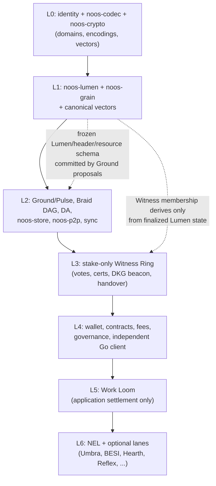

# Frozen Layered Dependency Graph — v1

Authority: plan §2.6. This graph is frozen **before** parallel implementation begins.

## The rule

Parallel implementation is allowed **only within one layer**, and only after **every**
input schema and canonical vector set from the preceding layer is frozen and hashed.
No lane may invent shared wire fields or activation semantics: anything two layers
consume is defined in the lower layer's frozen schema, never negotiated sideways.
Two hard edges called out by the plan:

- Ground proposals commit the **already-frozen** Lumen/header/resource schema (L1 → L2).
- Witness Ring membership derives **only** from finalized Lumen state (L1/L2 → L3).

A change to any frozen input schema/vector re-opens that layer and every layer above it;
it is a new schema version with new vectors, never an in-place edit.

## Layers

| Layer | Contents | Frozen inputs required before work starts |
|---|---|---|
| **L0** | Protocol identity (`identity-v1.md`), `noos-codec`, `noos-crypto`, crypto-domain registry | Identity table, domain table, codec encoding law |
| **L1** | `noos-lumen` (state, transactions, fees, issuance envelope), `noos-grain`, canonical vectors for both | All L0 schemas + positive/negative codec/crypto vectors |
| **L2** | Ground/Pulse, Braid DAG + fork choice, DA (`noos-da`), storage (`noos-store`), transport (`noos-p2p`), sync | Frozen Lumen/header/resource schemas + Grain vectors |
| **L3** | Stake-only Witness Ring: candidates, epoch snapshots, votes, certificates, slashing, DKG beacon, handover | Finalized-Lumen-state semantics + L2 block/vote wire schemas |
| **L4** | Wallet, ordinary Grain contracts, fee planning, governance objects, independent Go base client | L0–L3 frozen schemas/vectors (Go client consumes documents + vectors only, no shared code) |
| **L5** | Work Loom (application settlement only; zero consensus influence) | L4 contract/fee/receipt schemas |
| **L6** | NEL and all other optional/experimental lanes (Umbra suites, BESI, Hearth/Swarm/Chorus, Reflex, analytics) | L5 job/escrow schemas + their own registered domains; every activation control off at genesis |

## Diagram

## Consequences

- No crate in layer N may depend (build or runtime) on a crate in layer > N.
- Cross-layer test fixtures flow downward as frozen vectors, never as code imports.
- The independent Go client (L4) and Python small-state oracle share only frozen
  documents and vectors with the Rust stack — no generated codec, FFI, or copied oracle.
- L6 lanes ship disabled (`devnet-parameters.toml` controls) and can be removed
  without touching L0–L4 behavior; that removability is itself a release gate
  (AI-blackout scenarios).
